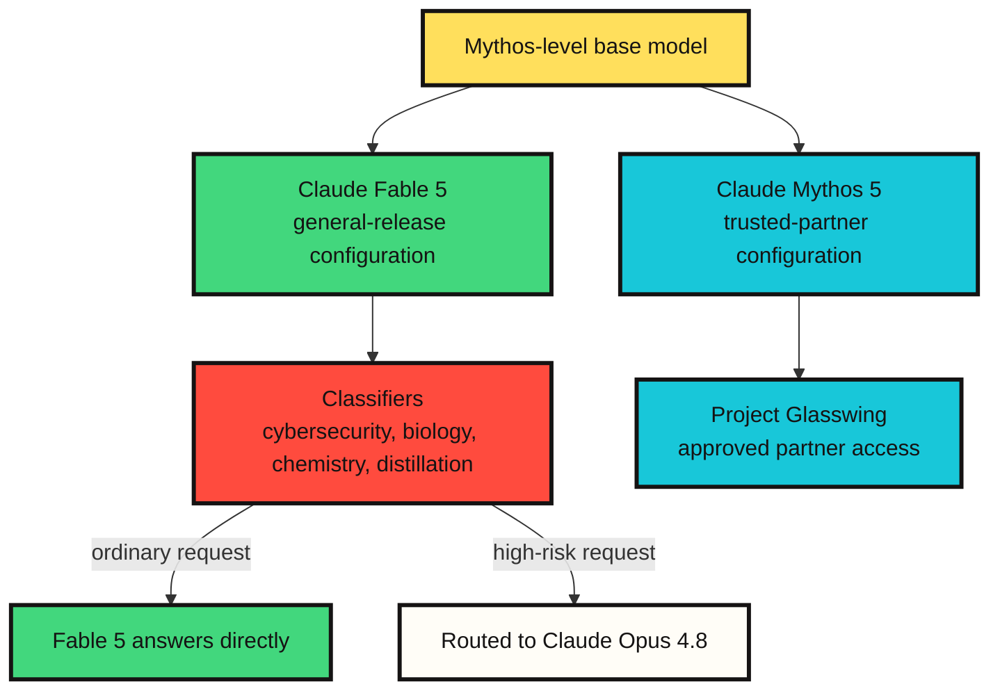

# What Claude Fable 5 and Mythos 5 reveal about a new model release pattern

As of June 10, 2026 in Korea, Anthropic's announcement is dated June 9, 2026. The company introduced Claude Fable 5 and Claude Mythos 5. This is not just another model launch. It is closer to ==a case where the same underlying model is distributed through different safeguards and access contracts==.

The core point is straightforward.

Claude Fable 5 is a Mythos-level model available to general users. Claude Mythos 5 uses the same underlying model, but is offered to trusted partners with some restrictions lifted in high-risk areas. The launch is therefore less about "a stronger model arrived" and more about "how far a powerful model can be opened, to whom, and under which conditions."

## One-line summary

Fable 5 is the publicly releasable Mythos. Mythos 5 is closer to a restricted original configuration. ==The difference between the two is less about capability type and more about safeguards and access scope.==

## What was released

Based on Anthropic's official materials, Fable 5 and Mythos 5 are two configurations of the same underlying model. Fable 5 adds safeguards for general use around cybersecurity, biology, chemistry, and model distillation attempts. When classifiers detect a request that may fall into a high-risk category, Fable 5 does not answer directly and the request is routed to Claude Opus 4.8.

Mythos 5, by contrast, is a configuration with some restrictions lifted. It is not generally available. Anthropic says Mythos 5 is available to Project Glasswing partners and selected trusted researchers.

| Category | Claude Fable 5 | Claude Mythos 5 |
|---|---|---|
| Access | Generally available model | Restricted-access model |
| Underlying model | Same underlying model as Mythos 5 | Same underlying model as Fable 5 |
| Main use | Long-running knowledge work, coding, agentic work, vision | Cybersecurity, biology, healthcare, scientific research |
| Safeguards | Routes cybersecurity, biology, chemistry, and distillation-related requests to Opus 4.8 | Some high-risk restrictions are relaxed for trusted partners |
| API model ID | `claude-fable-5` | `claude-mythos-5` |
| Context window | 1M tokens | 1M tokens |
| Max output | 128k tokens | 128k tokens |
| Pricing | $10 per million input tokens, $50 per million output tokens | $10 per million input tokens, $50 per million output tokens |

Availability also matters. According to the announcement, Fable 5 is available on the API and consumption-based Enterprise plans. It is included at no extra charge for Pro, Max, Team, and seat-based Enterprise plans from June 9 through June 22, 2026; from June 23, usage credits are required unless the included period is extended.

## The structure



The important point in this diagram is that ==Fable 5 is not simply a weaker model than Mythos 5==. Anthropic describes Fable 5 as using the same underlying model as Mythos 5. The difference is in distribution. Fable has safeguards that detect and route away risky domains for public release. Mythos relaxes some of those restrictions, but access itself is tightly controlled.

## Why split the names

The names are product positioning, but they also describe the access policy.

Anthropic describes Mythos-class models as a capability tier above Opus. Mythos Preview was released in April 2026 through Project Glasswing, and the June launch continues that path with Fable 5 and Mythos 5. The word Fable is semantically related to Mythos, but the practical dividing line is not the mood of the name. It is the safeguard layer.

In other words, the general user is not getting a "weak model." They are getting ==a public-release configuration that automatically falls back to a more conservative model in some areas==.

## What Fable 5 means

The interesting part of Fable 5 is not only benchmark scores, but task duration. Anthropic emphasizes long-running coding, complex knowledge work, vision-heavy work, and scientific research. Its product page highlights agent harnesses such as Claude Code and Claude Managed Agents, where the model can plan across stages, delegate to sub-agents, and check its own work over multi-day tasks.

This direction fits the broader agent trend. ==Model competition is moving beyond single-answer quality toward the ability to sustain long work, keep state, reuse intermediate artifacts, detect failure, and recover.==

Still, this claim currently rests largely on Anthropic's official materials and early partner reports. Real-world engineering teams still need to validate cost, failure modes, reproducibility, and interruption behavior.

## What Mythos 5 means

Mythos 5 requires more careful handling. Anthropic presents it as especially strong in cybersecurity and biology research. The system card describes Mythos 5 as the most capable model Anthropic has trained, and discusses dual-use risks in cybersecurity and biology.

Dual-use is the key phrase. The same capability can help defense and offense, therapeutic design and dangerous biological design. Mythos 5 is therefore not a public model. It is restricted to cyber defenders, infrastructure providers, and selected researchers.

==This structure may become the standard release pattern for frontier models.==

```text
The old pattern: divide products by model capability
The new pattern: divide products by capability + safeguards + access review + data-retention policy
```

## The key safeguard is routing, not refusal

Fable 5's interesting safety behavior is how it handles high-risk requests. Anthropic says that when Fable 5 classifiers detect cybersecurity, biology, chemistry, or distillation attempts, the request is routed to Claude Opus 4.8. Users are informed when this happens, and the request is billed according to the routed model rather than Fable pricing.

This is smoother than a hard refusal, but it creates new operational questions.

First, benign requests can be over-classified as high-risk. Anthropic says the safeguards are tuned conservatively and can produce false positives.

Second, users need to know which model actually answered. In a long-running workflow, a mid-task model change can affect reasoning style, code style, and output quality.

Third, researchers in high-risk domains are not merely asking for stronger model access. They are also accepting access review, data retention, and auditability.

## Developer checklist

If Fable 5 is attached to real work, these are the questions to track.

| Question | Why it matters |
|---|---|
| Does it actually reduce long-running work? | Multi-day agent work must include recovery and verification cost |
| How often does fallback occur? | Legitimate work near cybersecurity, biology, or chemistry may be routed to Opus 4.8 |
| Does output justify cost? | $10 input / $50 output per million tokens can be expensive for small experiments |
| Can the team accept 30-day data retention? | Fable and Mythos-class models require retention for safety monitoring |
| Is the result reproducible? | Longer tasks need separate measurement for repeatability |

## My read

==The real story of this release is distribution, not the model name.==

Fable 5 and Mythos 5 are Anthropic's answer to the question: can a very powerful model be generally released? Their answer is not simply yes or no. They use the same underlying model, add safeguards and routing to the public configuration, and place the less-restricted configuration behind trusted access.

As models approach high-risk domains, ==the difference between public and restricted models will be defined less by parameter counts or benchmark scores and more by access rights, monitoring policy, safeguards, and accountability structure.==

Fable 5 is therefore not just a new Claude model. It is a concrete example of the operating structure needed to make a frontier model public. Mythos 5 shows the other side: how access narrows when capability is too strong to release broadly.

## Sources

- [Anthropic, Claude Fable 5 and Claude Mythos 5](https://www.anthropic.com/news/claude-fable-5-mythos-5)
- [Anthropic, Claude Fable 5 product page](https://www.anthropic.com/claude/fable)
- [Anthropic, Claude Mythos 5 product page](https://www.anthropic.com/claude/mythos)
- [Claude API Docs, Models overview](https://platform.claude.com/docs/en/about-claude/models/overview)
- [Anthropic, System Card: Claude Fable 5 & Claude Mythos 5](https://www-cdn.anthropic.com/d00db56fa754a1b115b6dd7cb2e3c342ee809620.pdf)
