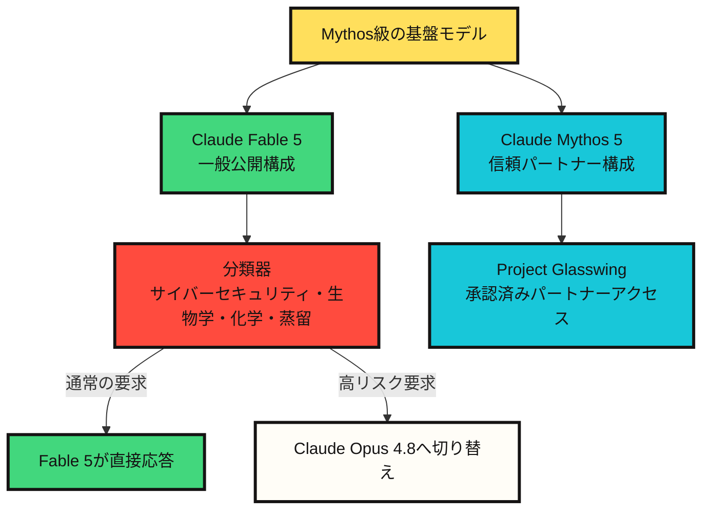

# Claude Fable 5とMythos 5が示すモデル公開の新しい形

韓国時間の2026年6月10日時点で確認すると、Anthropicの発表日は2026年6月9日である。同社はClaude Fable 5とClaude Mythos 5を公開した。これは単なる新モデル発表というより、==同じ基盤モデルを異なる安全策とアクセス契約で配布した事例==に近い。

核心は明確だ。

Claude Fable 5は、一般ユーザーが利用できるMythos級モデルである。Claude Mythos 5は同じ基盤モデルを使うが、一部の高リスク領域で制限が緩められ、信頼されたパートナーに限定して提供される。つまり今回の発表は「より強いモデルが出た」という話だけではなく、「強いモデルをどこまで、誰に、どの条件で開くのか」という問いに近い。

## 一行要約

Fable 5は公開可能なMythosであり、Mythos 5は制限付きで開かれた原型に近い。==両者の違いは能力の種類よりも、安全策とアクセス範囲にある。==

## 何が公開されたのか

Anthropicの公式説明を総合すると、Fable 5とMythos 5は同じ基盤モデルから作られた二つの構成である。Fable 5は一般利用のために、サイバーセキュリティ、生物学、化学、モデル蒸留の試みといった領域に追加の安全策を備える。分類器が高リスクと見なされる要求を検知すると、Fable 5は直接応答せず、Claude Opus 4.8に自動的に切り替える。

一方のMythos 5は、一部の制限が緩められた構成である。ただし一般公開モデルではない。AnthropicはMythos 5をProject Glasswingのパートナーと一部の信頼された研究者に限定して提供すると説明している。

| 区分 | Claude Fable 5 | Claude Mythos 5 |
|---|---|---|
| アクセス範囲 | 一般公開モデル | 制限アクセスモデル |
| 基盤モデル | Mythos 5と同じ基盤モデル | Fable 5と同じ基盤モデル |
| 主な用途 | 長時間の知識作業、コーディング、エージェント作業、画像理解 | サイバーセキュリティ、生物学、医療・科学研究 |
| 安全策 | サイバーセキュリティ・生物学・化学・蒸留関連要求をOpus 4.8へ切り替える | 一部の高リスク領域の制限を信頼されたパートナーに緩和 |
| APIモデルID | `claude-fable-5` | `claude-mythos-5` |
| コンテキスト | 100万トークン | 100万トークン |
| 最大出力 | 12万8千トークン | 12万8千トークン |
| 価格 | 入力100万トークンあたり10ドル、出力100万トークンあたり50ドル | 入力100万トークンあたり10ドル、出力100万トークンあたり50ドル |

利用可能範囲も区別する必要がある。公式発表によると、Fable 5はAPIと従量課金型Enterpriseプランで利用できる。Pro、Max、Team、座席ベースのEnterpriseプランでは2026年6月9日から6月22日まで追加費用なしで含まれ、2026年6月23日以降は利用クレジットが必要になる。

## 構造として見る



この図で重要なのは、==Fable 5が単純にMythos 5より弱いモデルではないという点==である。AnthropicはFable 5がMythos 5と同じ基盤モデルだと説明している。違いは配布経路にある。Fableは公開配布のために危険領域を検知し、より保守的な応答経路へ切り替える安全策を持つ。Mythosはその制限の一部が緩和されるが、アクセス資格そのものが強く制限される。

## なぜ名前を分けたのか

モデル名は製品の位置づけでもあるが、今回はアクセス方針を説明する名前に近い。

AnthropicはMythos級モデルをOpus級より高い能力階層として説明している。Mythos Previewは2026年4月にProject Glasswingを通じて制限付きで提供され、今回の発表でFable 5とMythos 5へ続いた。Fableという語はMythosと意味的に近いが、実際の境界線は名前の響きではなく安全策である。

つまり一般ユーザーが使うのは「弱いモデル」ではなく、==一部領域で自動的により保守的なモデルへ切り替わる公開構成==である。

## Fable 5の意味

Fable 5で注目すべき点は、ベンチマークの数字だけではなく作業時間の長さである。Anthropicは、長時間のコーディング、複雑な知識作業、画像を含む作業、科学研究で以前の公開モデルより強いと説明している。製品ページでは、Claude CodeやClaude Managed Agentsのような実行環境で、複数段階の計画、サブエージェントへの委任、自分の作業の確認を数日単位で行う用途が強調されている。

この方向性は最近のエージェントの流れと一致している。==モデルの競争力は、単発の回答品質から、長い作業を維持し、失敗を検知して復旧する能力へ移っている。==

ただし、この主張は現時点では主にAnthropicの公式説明と初期パートナー評価に基づく。実際の開発組織では、費用、失敗パターン、再現性、長時間作業の中断条件を別途検証する必要がある。

## Mythos 5の意味

Mythos 5はより慎重に扱う必要がある。AnthropicはMythos 5をサイバーセキュリティと生物学研究に特に強いモデルとして説明している。システムカードでもMythos 5はAnthropicが訓練した最も強いモデルとされ、サイバーセキュリティと生物学におけるデュアルユースリスクが大きく扱われている。

ここで重要なのはデュアルユースである。同じ能力が防御にも攻撃にも、治療薬設計にも危険な生物学的設計にも使われ得る。そのためMythos 5は公開モデルではなく、防御側、インフラ提供者、一部研究者に限定して開かれる。

==この構造は、今後のfrontier model公開の標準パターンになる可能性がある。==

```text
従来: モデル能力だけで製品を分ける
今後: 能力 + 安全策 + アクセス審査 + データ保持方針で分ける
```

## 安全策の核心は拒否ではなく切り替えである

Fable 5で興味深いのは、高リスク要求への処理方法である。Anthropicは、Fable 5の分類器がサイバーセキュリティ、生物学・化学、蒸留の試みを検知すると、Claude Opus 4.8へ自動的に切り替えると説明している。ユーザーには切り替えが通知され、Fable価格ではなく切り替え先モデルの基準で扱われる。

この方式は単純な拒否より滑らかだが、新しい運用上の問題も作る。

第一に、正常な要求が高リスク要求として誤分類される可能性がある。Anthropicも安全策を保守的に調整しているため、一部の無害な要求が引っかかる可能性があると述べている。

第二に、同じ質問でも実際にどのモデルが答えたのかを確認する必要がある。長時間の作業中にモデルが切り替わると、推論の傾向、コードのスタイル、出力品質が変わり得る。

第三に、高リスク領域の研究者は、強いモデルへのアクセスだけでなく、アクセス審査、データ保持、監査可能性も受け入れる必要がある。

## 開発者のチェックリスト

Fable 5を実際の作業に組み込むなら、次を確認する必要がある。

| 質問 | 見るべき理由 |
|---|---|
| 長時間作業は本当に短縮されるか | 数日単位のエージェント作業では復旧と検証の費用も含める必要がある |
| 切り替えはどれくらい発生するか | 正当なセキュリティ・生物学・化学研究でもOpus 4.8に切り替わり得る |
| 費用に見合う成果が出るか | 入力100万トークン10ドル、出力100万トークン50ドルは小さな実験には重い |
| 30日間のデータ保持を受け入れられるか | FableとMythos級モデルには安全監視のための保持方針が付く |
| 再現可能か | 長い作業ほど同じ指示で同じ結果が出るかを別途測る必要がある |

## 私の見方

==今回の発表の本質は、モデル名よりも配布方式にある。==

Fable 5とMythos 5は、「強いモデルを一般公開できるのか」という問いへのAnthropicの答えである。その答えは単純なイエスでもノーでもない。同じ基盤モデルに対して、公開構成には安全策と切り替え規則を付け、制限構成には信頼ベースのアクセス契約を付ける。

モデル能力が高リスク領域に近づくほど、==公開モデルと制限モデルの違いは、パラメータ数やベンチマーク点数よりも、アクセス権、監視方針、安全策、責任構造によって決まる。==

したがってFable 5は単なる新しいClaudeモデルではない。公開可能なfrontier modelを作るために必要な運用構造を示す事例である。Mythos 5はその反対側で、能力が強すぎるときに公開範囲をどう狭めるかを示している。

## Sources

- [Anthropic, Claude Fable 5 and Claude Mythos 5](https://www.anthropic.com/news/claude-fable-5-mythos-5)
- [Anthropic, Claude Fable 5 product page](https://www.anthropic.com/claude/fable)
- [Anthropic, Claude Mythos 5 product page](https://www.anthropic.com/claude/mythos)
- [Claude API Docs, Models overview](https://platform.claude.com/docs/en/about-claude/models/overview)
- [Anthropic, System Card: Claude Fable 5 & Claude Mythos 5](https://www-cdn.anthropic.com/d00db56fa754a1b115b6dd7cb2e3c342ee809620.pdf)
