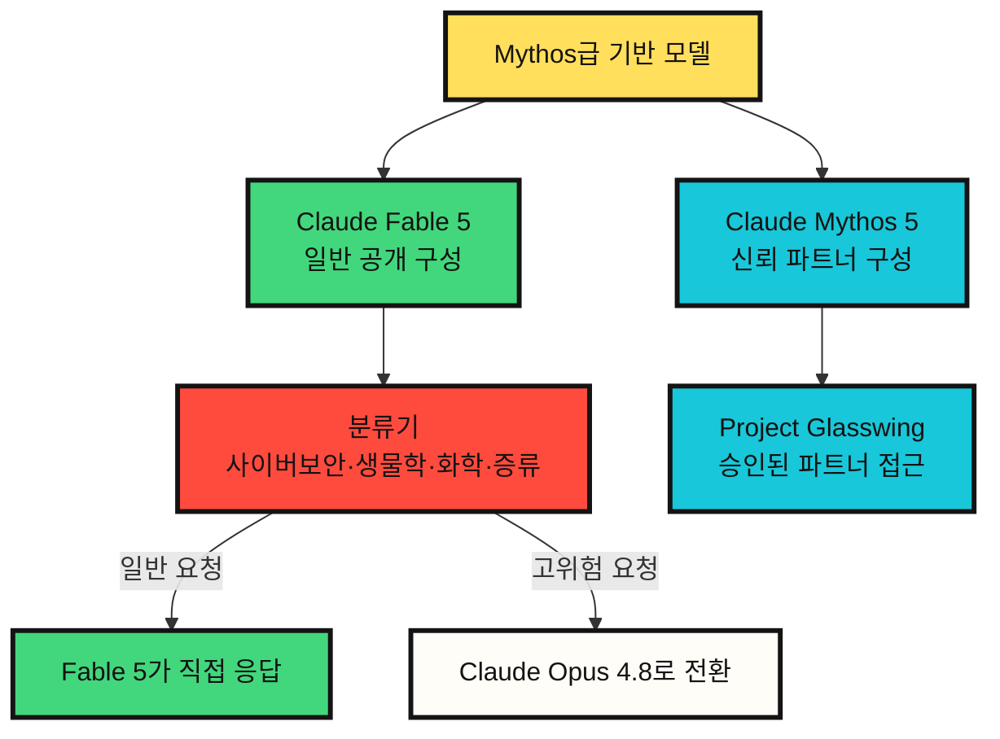

# Claude Fable 5와 Mythos 5가 보여준 모델 출시의 새 형태

2026년 6월 10일 한국 시간 기준으로 확인하면, Anthropic은 2026년 6월 9일에 Claude Fable 5와 Claude Mythos 5를 공개했다. 이번 발표는 단순한 새 모델 출시라기보다, ==같은 기반 모델을 서로 다른 안전장치와 접근 계약으로 나누어 배포한 사례==에 가깝다.

핵심은 명확하다.

Claude Fable 5는 일반 사용자가 접근할 수 있는 Mythos급 모델이다. Claude Mythos 5는 같은 기반 모델이지만, 일부 고위험 영역의 제한이 풀린 형태로 신뢰된 파트너에게만 제공된다. 그래서 이번 출시는 "더 강한 모델이 나왔다"보다 "강한 모델을 어디까지, 누구에게, 어떤 조건으로 열 것인가"라는 질문에 더 가깝다.

## 한 줄 요약

Fable 5는 공개 가능한 Mythos이고, Mythos 5는 제한적으로 개방된 원형에 가깝다. ==두 모델의 차이는 능력의 종류보다 안전장치와 접근 범위에 있다.==

## 무엇이 공개되었나

Anthropic의 공식 설명을 종합하면 Fable 5와 Mythos 5는 같은 기반 모델에서 나온 두 구성이다. Fable 5는 일반 사용을 위해 사이버보안, 생물학, 화학, 모델 증류 시도 같은 영역에 추가 안전장치를 붙인 모델이다. 해당 분류기가 위험하거나 고위험 요청으로 볼 수 있는 내용을 감지하면 Fable 5가 직접 답하지 않고 Claude Opus 4.8로 자동 전환된다.

반대로 Mythos 5는 일부 제한이 풀린 형태다. 다만 일반 공개 모델은 아니다. Anthropic은 Mythos 5를 Project Glasswing 파트너와 일부 신뢰된 연구자에게 제한적으로 제공한다고 설명한다.

| 구분 | Claude Fable 5 | Claude Mythos 5 |
|---|---|---|
| 접근 범위 | 일반 공개 모델 | 제한 접근 모델 |
| 기반 모델 | Mythos 5와 같은 기반 모델 | Fable 5와 같은 기반 모델 |
| 주요 용도 | 장기 실행 지식 작업, 코딩, 에이전트 작업, 시각 이해 | 사이버보안, 생물학, 의료·과학 연구 |
| 안전장치 | 사이버보안·생물학·화학·증류 관련 요청을 분류해 Opus 4.8로 전환 | 일부 고위험 영역의 제한을 신뢰된 파트너에게 완화 |
| API 모델 ID | `claude-fable-5` | `claude-mythos-5` |
| 컨텍스트 | 100만 토큰 | 100만 토큰 |
| 최대 출력 | 12만 8천 토큰 | 12만 8천 토큰 |
| 가격 | 입력 100만 토큰당 10달러, 출력 100만 토큰당 50달러 | 입력 100만 토큰당 10달러, 출력 100만 토큰당 50달러 |

이용 가능 범위도 구분해야 한다. 공식 발표 기준으로 Fable 5는 API와 사용량 기반 Enterprise 요금제에서 바로 사용할 수 있다. Pro, Max, Team, 좌석 기반 Enterprise 요금제에는 2026년 6월 9일부터 2026년 6월 22일까지 추가 비용 없이 포함되며, 2026년 6월 23일부터는 사용 크레딧이 필요하다고 안내되어 있다. 수요와 용량에 따라 이 포함 기간은 조정될 수 있다.

## 구조로 보면 이렇게 보인다



이 그림에서 중요한 지점은 ==Fable 5가 단순히 Mythos 5보다 낮은 모델이 아니라는 점==이다. Anthropic은 Fable 5가 Mythos 5와 같은 기반 모델이라고 설명한다. 차이는 배포 경로에 있다. Fable은 공개 배포를 위해 위험 영역을 감지하고 우회시키는 안전장치를 가진다. Mythos는 그 제한이 일부 완화되지만, 접근 자격 자체가 강하게 제한된다.

## 왜 이름을 나누었을까

모델 이름은 제품 포지셔닝이기도 하지만, 이번 경우에는 접근 정책을 설명하는 이름에 가깝다.

Anthropic은 Mythos급 모델이 Opus급보다 높은 능력 계층이라고 설명한다. Mythos Preview는 2026년 4월 Project Glasswing을 통해 제한적으로 제공되었고, 이번 발표에서 Fable 5와 Mythos 5로 이어졌다. Fable이라는 이름은 이야기, 우화에 가까운 어원을 갖고 있고 Mythos와도 의미적으로 연결된다. 하지만 실제 구분선은 이름의 느낌이 아니라 안전장치다.

즉 일반 사용자가 접하는 것은 "약한 모델"이 아니라 ==일부 영역에서 자동으로 더 보수적인 모델로 전환되는 공개형 구성==이다.

## Fable 5의 의미

Fable 5에서 주목할 부분은 벤치마크 숫자보다 작업 시간의 길이다. Anthropic은 Fable 5가 장기 실행 코딩, 복잡한 지식 작업, 시각 기반 작업, 과학 연구에서 이전 공개 모델보다 강하다고 설명한다. 제품 페이지는 Claude Code나 관리형 에이전트 같은 실행 환경에서 며칠 단위 작업을 수행하고, 계획을 세우며, 하위 에이전트에 일을 나누고, 자기 작업을 점검하는 용도를 강조한다.

이 방향은 최근의 에이전트 흐름과 정확히 맞물린다. ==모델의 경쟁력이 단일 답변 품질에서 끝나지 않고, 긴 작업을 유지하고 실패를 복구하는 능력으로 옮겨가고 있다.==

다만 이 주장은 아직 대부분 Anthropic의 공식 주장과 초기 파트너 평가에 기반한다. 실제 개발 조직에서의 비용, 실패 양상, 재현성, 장기 작업 중단 조건은 별도로 검증해야 한다.

## Mythos 5의 의미

Mythos 5는 더 조심스럽게 다뤄야 한다. Anthropic은 Mythos 5가 사이버보안과 생물학 연구에서 특히 강한 모델이라고 설명한다. 시스템 카드도 Mythos 5를 Anthropic이 훈련한 가장 강한 모델로 소개하고, 사이버보안 과제와 생물학 과제에서의 이중용도 위험을 크게 다룬다.

여기서 이중용도라는 말이 중요하다. 같은 능력이 방어와 공격, 치료제 설계와 위험한 생물학적 설계 양쪽에 쓰일 수 있다. 그래서 Mythos 5는 공개 모델이 아니라, 방어자와 기반시설 제공자, 그리고 일부 연구자에게 제한적으로 열린다.

==이 구조는 앞으로 frontier model 배포의 표준 패턴이 될 가능성이 있다.==

```text
모델 능력만으로 제품을 나누는 시대
-> 모델 능력 + 안전장치 + 접근 심사 + 데이터 보존 정책으로 제품을 나누는 시대
```

## 안전장치의 핵심은 거절이 아니라 전환이다

Fable 5에서 흥미로운 점은 고위험 요청에 대한 기본 처리 방식이다. Anthropic은 Fable 5의 분류기가 사이버보안, 생물학·화학, 증류 시도를 감지하면 Claude Opus 4.8로 자동 전환된다고 설명한다. 사용자는 전환 사실을 알 수 있고, Fable 가격이 아니라 전환된 모델 기준으로 처리된다.

이 방식은 단순 거절보다 사용자 경험이 부드럽다. 하지만 동시에 새로운 운영 문제를 만든다.

첫째, 정상 요청이 고위험 요청으로 오분류될 수 있다. Anthropic도 안전장치를 보수적으로 조정했기 때문에 일부 무해한 요청이 걸릴 수 있다고 말한다.

둘째, 같은 질문이라도 어느 모델이 실제로 답했는지 확인해야 한다. 장기 작업에서 중간에 모델이 바뀌면 추론 성향, 코드 스타일, 응답 품질이 달라질 수 있다.

셋째, 고위험 영역의 연구자는 "강한 모델 접근권"뿐 아니라 접근 심사, 데이터 보존, 감사 가능성까지 받아들여야 한다.

## 개발자 관점의 체크리스트

Fable 5를 실제 작업에 붙인다면 다음을 확인해야 한다.

| 질문 | 봐야 할 이유 |
|---|---|
| 장기 작업이 정말 줄어드는가 | 며칠짜리 에이전트 작업은 실패 복구와 검증 비용까지 포함해 봐야 한다 |
| 전환이 얼마나 자주 발생하는가 | 사이버보안·생물학·화학 근처의 합법적 연구에서도 Opus 4.8로 넘어갈 수 있다 |
| 비용 대비 산출물이 나오는가 | 입력 100만 토큰당 10달러, 출력 100만 토큰당 50달러는 작은 실험에는 부담이 될 수 있다 |
| 30일 데이터 보존을 받아들일 수 있는가 | Fable과 Mythos급 모델은 안전 모니터링을 위한 보존 정책이 붙는다 |
| 재현 가능한가 | 긴 작업일수록 같은 지시에서 같은 결과가 나오는지 별도 측정이 필요하다 |

## 내 판단

==이번 발표의 본질은 모델 이름보다 배포 방식이다.==

Fable 5와 Mythos 5는 "강한 모델을 일반 공개할 수 있는가"라는 질문에 대한 Anthropic의 답이다. 그 답은 단순한 예 또는 아니오가 아니다. 같은 기반 모델을 두고, 공개형 모델에는 안전장치와 전환 규칙을 붙이고, 제한형 모델에는 신뢰 기반 접근 계약을 붙인다.

이 방식은 앞으로 더 중요해질 가능성이 높다. 모델 능력이 위험 영역에 가까워질수록, ==공개 모델과 비공개 모델의 차이는 파라미터 수나 벤치마크 점수보다 접근 권한, 감시 정책, 안전장치, 책임 구조로 결정될 것이다.==

따라서 Fable 5는 단순히 새 Claude 모델이 아니다. 공개 가능한 frontier model을 만들기 위해 어떤 운영 구조가 필요한지 보여주는 사례다. Mythos 5는 그 반대편에서, 능력이 너무 강할 때 공개 범위를 어떻게 좁힐 것인지 보여준다.

## Sources

- [Anthropic, Claude Fable 5 and Claude Mythos 5](https://www.anthropic.com/news/claude-fable-5-mythos-5)
- [Anthropic, Claude Fable 5 product page](https://www.anthropic.com/claude/fable)
- [Anthropic, Claude Mythos 5 product page](https://www.anthropic.com/claude/mythos)
- [Claude API Docs, Models overview](https://platform.claude.com/docs/en/about-claude/models/overview)
- [Anthropic, System Card: Claude Fable 5 & Claude Mythos 5](https://www-cdn.anthropic.com/d00db56fa754a1b115b6dd7cb2e3c342ee809620.pdf)
