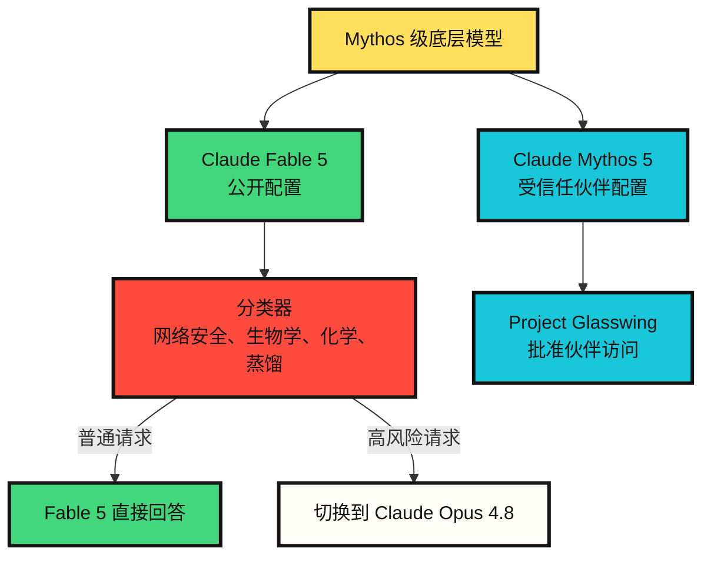

# Claude Fable 5 与 Mythos 5 展示的新模型发布方式

按韩国时间 2026 年 6 月 10 日确认，Anthropic 的公告日期是 2026 年 6 月 9 日。该公司发布了 Claude Fable 5 和 Claude Mythos 5。这不只是一次普通的新模型发布，更像是 ==把同一个底层模型通过不同安全机制和访问合约进行分发的案例==。

核心很清楚。

Claude Fable 5 是普通用户可以访问的 Mythos 级模型。Claude Mythos 5 使用同一个底层模型，但在部分高风险领域解除了一些限制，只提供给受信任的合作伙伴。因此，这次发布的重点不只是“更强的模型来了”，而是“强模型可以开放到什么程度、给谁使用、在什么条件下使用”。

## 一句话概括

Fable 5 是可以公开提供的 Mythos；Mythos 5 更接近受限开放的原型配置。==两者的差异不主要在能力类型，而在安全机制和访问范围。==

## 发布了什么

综合 Anthropic 的官方说明，Fable 5 和 Mythos 5 是同一个底层模型的两种配置。Fable 5 面向一般使用，针对网络安全、生物学、化学、模型蒸馏尝试等领域增加了安全机制。当分类器检测到可能属于高风险类别的请求时，Fable 5 不会直接回答，而是自动切换到 Claude Opus 4.8。

相反，Mythos 5 是解除部分限制的配置。但它不是公开模型。Anthropic 表示，Mythos 5 仅提供给 Project Glasswing 合作伙伴和部分受信任研究者。

| 项目 | Claude Fable 5 | Claude Mythos 5 |
|---|---|---|
| 访问范围 | 公开模型 | 受限访问模型 |
| 底层模型 | 与 Mythos 5 相同 | 与 Fable 5 相同 |
| 主要用途 | 长周期知识工作、代码、智能体任务、视觉理解 | 网络安全、生物学、医疗和科学研究 |
| 安全机制 | 将网络安全、生物学、化学、蒸馏相关请求切换到 Opus 4.8 | 对受信任伙伴放宽部分高风险限制 |
| API 模型 ID | `claude-fable-5` | `claude-mythos-5` |
| 上下文窗口 | 100 万 token | 100 万 token |
| 最大输出 | 12.8 万 token | 12.8 万 token |
| 价格 | 输入每百万 token 10 美元，输出每百万 token 50 美元 | 输入每百万 token 10 美元，输出每百万 token 50 美元 |

可用范围也需要区分。根据官方公告，Fable 5 可在 API 和按量计费的 Enterprise 计划中使用。Pro、Max、Team 和按席位计费的 Enterprise 计划在 2026 年 6 月 9 日至 6 月 22 日期间可额外免费使用；从 2026 年 6 月 23 日开始，除非包含期延长，否则需要使用额度。

## 从结构上看



这个图的关键在于，==Fable 5 并不是简单地比 Mythos 5 更弱==。Anthropic 说明 Fable 5 与 Mythos 5 使用同一个底层模型。差异在分发路径。Fable 为了公开发布，会检测高风险领域并切换到更保守的响应路径。Mythos 放宽了部分限制，但访问资格本身受到严格控制。

## 为什么要分成两个名字

模型名称当然也有产品定位作用，但这一次更像是在说明访问政策。

Anthropic 将 Mythos 级模型描述为高于 Opus 级的能力层。Mythos Preview 在 2026 年 4 月通过 Project Glasswing 受限提供，而这次发布延续为 Fable 5 和 Mythos 5。Fable 这个词在含义上与 Mythos 接近，但实际分界线不是名称的感觉，而是安全机制。

换句话说，普通用户接触到的不是“弱模型”，而是 ==在部分领域会自动切换到更保守模型的公开配置==。

## Fable 5 的意义

Fable 5 值得关注的不只是基准分数，而是任务持续时间。Anthropic 强调 Fable 5 在长周期代码任务、复杂知识工作、视觉任务和科学研究中比此前公开模型更强。产品页也强调，在 Claude Code 或 Claude Managed Agents 这类执行环境中，它可以跨阶段规划、委派子智能体，并检查自己的工作。

这个方向与近期智能体趋势高度一致。==模型竞争力正在从单次回答质量，转向维持长任务、复用中间成果、发现失败并恢复的能力。==

不过，这一判断目前主要来自 Anthropic 官方材料和早期合作伙伴反馈。真实开发组织仍需单独验证成本、失败模式、可复现性和长周期任务的中断条件。

## Mythos 5 的意义

Mythos 5 需要更谨慎地对待。Anthropic 将它描述为在网络安全和生物学研究上特别强的模型。系统卡也把 Mythos 5 称为 Anthropic 训练过的最强模型，并重点讨论了网络安全和生物学中的双重用途风险。

双重用途是关键。同一种能力可以用于防御，也可以用于攻击；可以用于治疗设计，也可能用于危险的生物设计。因此 Mythos 5 不是公开模型，而是面向防御者、基础设施提供者和部分研究者的受限模型。

==这种结构可能会成为未来 frontier model 发布的标准模式。==

```text
过去：按模型能力划分产品
以后：按能力 + 安全机制 + 访问审查 + 数据保留政策划分产品
```

## 安全机制的核心不是拒绝，而是切换

Fable 5 的有趣之处在于它处理高风险请求的方式。Anthropic 表示，当 Fable 5 的分类器检测到网络安全、生物学、化学或蒸馏尝试时，请求会自动切换到 Claude Opus 4.8。用户会被告知发生了切换，并且按切换后的模型计费，而不是按 Fable 价格处理。

这种方式比直接拒绝更平滑，但也带来新的运行问题。

第一，正常请求可能被误判为高风险请求。Anthropic 也表示，安全机制调得比较保守，因此一些无害请求可能会被触发。

第二，同一个问题也需要确认到底由哪个模型回答。长周期工作中途切换模型，可能影响推理风格、代码风格和输出质量。

第三，高风险领域研究者要获得的不只是强模型访问权，还要接受访问审查、数据保留和可审计性。

## 开发者检查清单

如果把 Fable 5 接入真实工作，需要检查以下问题。

| 问题 | 为什么重要 |
|---|---|
| 长周期工作是否真的减少 | 多天智能体任务必须把恢复和验证成本算进去 |
| 切换发生得有多频繁 | 合法的网络安全、生物学、化学研究也可能切换到 Opus 4.8 |
| 产出是否覆盖成本 | 输入每百万 token 10 美元、输出每百万 token 50 美元，对小实验并不便宜 |
| 是否接受 30 天数据保留 | Fable 和 Mythos 级模型带有安全监控所需的数据保留政策 |
| 结果能否复现 | 任务越长，越需要单独测量同一指令下的稳定性 |

## 我的判断

==这次发布的本质不是模型名称，而是分发方式。==

Fable 5 与 Mythos 5 是 Anthropic 对“非常强的模型能否公开发布”这一问题的回答。答案不是简单的是或否。它们使用同一个底层模型，在公开配置上加入安全机制和切换规则，在受限配置上加入基于信任的访问合约。

随着模型能力接近高风险领域，==公开模型和受限模型的差异，将越来越少由参数量或基准分数决定，而更多由访问权、监控政策、安全机制和责任结构决定。==

因此，Fable 5 不只是新的 Claude 模型。它展示了让 frontier model 可公开使用所需的运行结构。Mythos 5 则展示了另一面：当能力过强时，如何缩小公开范围。

## Sources

- [Anthropic, Claude Fable 5 and Claude Mythos 5](https://www.anthropic.com/news/claude-fable-5-mythos-5)
- [Anthropic, Claude Fable 5 product page](https://www.anthropic.com/claude/fable)
- [Anthropic, Claude Mythos 5 product page](https://www.anthropic.com/claude/mythos)
- [Claude API Docs, Models overview](https://platform.claude.com/docs/en/about-claude/models/overview)
- [Anthropic, System Card: Claude Fable 5 & Claude Mythos 5](https://www-cdn.anthropic.com/d00db56fa754a1b115b6dd7cb2e3c342ee809620.pdf)
