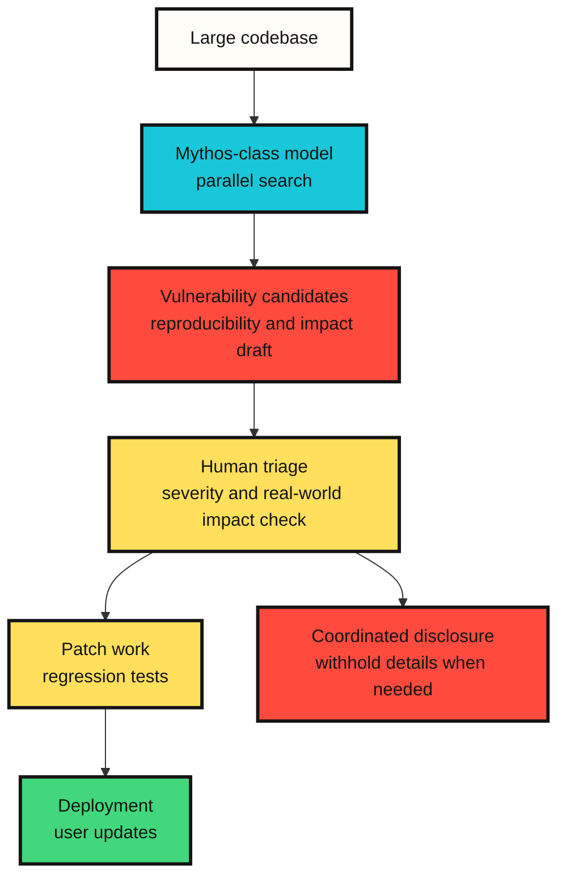

# What Claude Mythos 5 asks of the security industry

From a security perspective, the most important change in Claude Mythos 5 is not raw model capability. The larger change is that ==the cost structure of finding vulnerabilities, validating them, and judging exploitability is changing==.

When Anthropic discusses Mythos Preview and Mythos 5 publicly, it returns to the same problem. Strong models can help defenders, but the same capability can also help attackers. That is why Mythos 5 is not generally released. It is offered through Project Glasswing and trusted-access programs.

This article treats Mythos 5 not simply as a "strong security model," but as **a signal that security operating systems need to be redesigned**.

## Why it matters in security

A general coding model reads and edits code. A security model goes one step further. It reads code, finds weak points, and reasons about whether those weaknesses can actually be exploited. That distinction is large.

According to Anthropic's Red Team writing and system card, Mythos-class models showed a clear jump in vulnerability discovery and exploit development tasks. In particular, Mythos Preview was presented as finding previously unknown vulnerabilities in real open-source codebases and, in some cases, analyzing exploitability. The Mythos 5 system card says this class of capability remains present or has been strengthened.

The point the security industry should notice is not the sensational sentence "AI can hack." The more accurate sentence is closer to this:

==Part of the vulnerability research and exploitability review that used to take experts a long time is becoming model-driven parallel search.==

## Good news and bad news for defenders

The good news is clear. If defenders use the same kind of model, they can find hidden problems faster in old code, complex parsers, kernels, browsers, multimedia libraries, and cloud software. Project Glasswing is aimed precisely at that direction.

The bad news is also clear. If vulnerability discovery accelerates, patching and deployment become the bottleneck. Anthropic's initial Glasswing update addresses this directly. There has always been a long delay between vulnerability discovery, patch creation, and user deployment. Mythos-class models lower the cost of discovery and exploitability review, increasing the risk created by that delay.

In short, the bottleneck in security organizations moves from "finding" to "processing."

```text
Old bottleneck: not finding vulnerabilities quickly enough
New bottleneck: validating, patching, and deploying too many high-quality candidates
```

## The operating model changes like this



In this structure, the model is not the final judge. It creates candidates, improves reproducibility, and turns findings into reports humans can review. Final judgment still belongs to human triage, maintainers, security teams, and deployment owners.

==The value of Mythos-class models is less in replacing humans and more in producing large volumes of high-quality candidates that humans must review.==

## What exploit evaluations imply

Anthropic Red Team discussed Mythos Preview alongside evaluations such as ExploitBench, ExploitGym, and SCONE-bench. The important point is not any one attack technique. The important point is the level of evaluation.

Older evaluations were closer to asking whether a model could show that a vulnerability exists. Harder evaluations ask whether the model can develop that vulnerability toward real impact. Anthropic says Mythos Preview substantially outperformed previous models on this kind of evaluation.

Read from the defender's side, the implication is this:

==The distance between "a vulnerability exists" and "it can be exploited in practice" is shrinking.==

Security teams now need to connect "there is a bug" and "this is dangerous" more quickly. It is not enough to pile up candidate vulnerabilities as a list. Teams need to judge impact, exposed surface, patch difficulty, bypass potential, and deployment delay together.

## Restricted access is risk management, not just product gating

Mythos 5 is offered through restricted access not simply because of commercial scarcity. Anthropic's official explanation says access is limited because dual-use risk is high in cybersecurity and biology.

That distribution model matters. Fable 5 is the same underlying model with safeguards for public release. Requests classified as high-risk are routed to Claude Opus 4.8. Mythos 5 relaxes some restrictions, but is offered mainly through approved partners such as Project Glasswing.

This is a new form of security-tool distribution.

```text
Release a powerful model to everyone
-> Split risky domains through safeguards and access review
```

==Future security models may be differentiated less by capability alone and more by access contracts, auditability, data retention, and purpose verification.==

## What defenders should prepare

If Mythos-class models become more widespread, security teams cannot treat them as just another tool. They need to change the operating system around the tool.

| Change | Required response |
|---|---|
| More vulnerability candidates | Automated classification, deduplication, and impact-based triage |
| Faster exploitability review | Shorter patch priorities and deployment deadlines |
| More pressure on open-source maintainers | Report quality standards, reproducible environments, coordinated disclosure process |
| Lower attacker cost | Smaller external attack surface, patch-delay monitoring, vulnerable-version inventory |
| Restricted model access | Verified security researcher programs and audit logs |

Patch deployment is especially important. A model finding vulnerabilities quickly does not automatically make users safer. A patch must be written, released, and actually applied in user environments. If that gap remains long, faster discovery can enlarge the window of risk.

## My view

The security meaning of Mythos 5 is not "AI becomes the attacker." That is too crude. The more precise judgment is this:

==Mythos-class models lower the unit cost of vulnerability research and move the bottleneck of security organizations from discovery to validation, patching, and deployment.==

This change is double-edged. If defenders organize first, they can reduce old vulnerabilities at scale. But in ecosystems where patching is slow and maintainers are exhausted, the discovery speed produced by models may favor attackers more.

So the key question around Mythos 5 is not whether we can access the model. The more important question is this:

==Do we have the operational ability to turn security knowledge found by models into real patches and deployments?==

## Sources

- [Anthropic, Claude Fable 5 and Claude Mythos 5](https://www.anthropic.com/news/claude-fable-5-mythos-5)
- [Anthropic, Claude Mythos 5 product page](https://www.anthropic.com/claude/mythos)
- [Anthropic, Project Glasswing](https://www.anthropic.com/glasswing)
- [Anthropic, Project Glasswing: An initial update](https://www.anthropic.com/research/glasswing-initial-update)
- [Anthropic, Expanding Project Glasswing](https://www.anthropic.com/news/expanding-project-glasswing)
- [Anthropic Red Team, Assessing Claude Mythos Preview's cybersecurity capabilities](https://red.anthropic.com/2026/mythos-preview/)
- [Anthropic Red Team, Measuring LLMs' ability to develop exploits](https://red.anthropic.com/2026/exploit-evals/)
- [Anthropic, System Card: Claude Fable 5 & Claude Mythos 5](https://www-cdn.anthropic.com/d00db56fa754a1b115b6dd7cb2e3c342ee809620.pdf)
