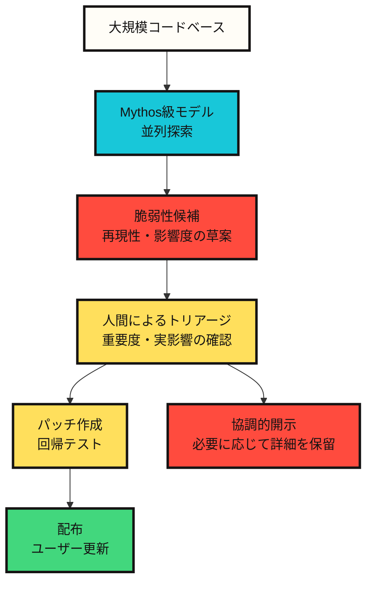

# Claude Mythos 5がセキュリティ業界に投げかける問い

Claude Mythos 5をセキュリティの視点で見ると、最も重要な変化はモデル性能そのものではない。より大きな変化は、==脆弱性を見つけ、検証し、悪用可能性を判断するコスト構造が変わりつつあること==だ。

AnthropicはMythos PreviewとMythos 5を公開資料で説明するとき、同じ問題を繰り返し取り上げている。強いモデルは防御側に役立つが、同じ能力は攻撃側にも役立つ。そのためMythos 5は一般公開ではなく、Project Glasswingと信頼ベースのアクセスプログラムを通じて限定的に提供される。

この記事ではMythos 5を「強いセキュリティモデル」としてではなく、**セキュリティ運用体制を再設計させる信号**として見る。

## なぜセキュリティで特別なのか

一般的なコーディングモデルはコードを読み、修正する。セキュリティモデルはそこから一段進む。コードを読み、弱い箇所を見つけ、その弱点が実際に悪用可能かどうかを推論する。この差は大きい。

AnthropicのRed Team記事とシステムカードによれば、Mythos系モデルは既存モデルに比べて脆弱性発見とエクスプロイト開発の課題で大きな差を示した。特にMythos Previewは、実際のオープンソースコードベースで未公開の脆弱性を見つけ、一部のケースでは悪用可能性まで分析した事例として紹介された。Mythos 5のシステムカードも、この系統の能力が維持または強化されていると説明している。

ここでセキュリティ業界が見るべき核心は、「AIがハッキングする」という刺激的な文ではない。より正確には、次の文に近い。

==専門家が時間をかけて行っていた脆弱性調査と悪用可能性の検討の一部が、モデルによる並列探索へ変わりつつある。==

## 防御側にとって良い知らせと悪い知らせ

良い知らせは明確だ。同じモデルを防御側が使えば、古いコード、複雑なパーサー、カーネル、ブラウザ、マルチメディアライブラリ、クラウドソフトウェアに隠れていた問題をより早く見つけられる。Project Glasswingはまさにこの方向を狙っている。

悪い知らせも明確だ。脆弱性発見の速度が上がると、パッチと配布がボトルネックになる。AnthropicのGlasswing初期アップデートはこの問題を直接取り上げている。脆弱性の発見、パッチ作成、ユーザーへの配布の間にはもともと長い遅延があった。Mythos級モデルは発見と悪用可能性検討のコストを下げることで、この遅延が生むリスクを大きくする。

つまり、セキュリティ組織のボトルネックは「見つけること」から「処理すること」へ移動する。

```text
従来のボトルネック: 脆弱性を十分に早く見つけられない
新しいボトルネック: 多数の高品質候補を検証し、パッチを書き、配布しなければならない
```

## 運用構造として見るとこう変わる



この構造でモデルは最終判定者ではない。モデルは候補を作り、再現性を高め、人間が読める報告書の形に整理する。最終判断は依然として人間のトリアージ、プロジェクトメンテナー、セキュリティチーム、配布責任者が担うべきだ。

==Mythos級モデルの価値は人間を置き換えることよりも、人間が検討すべき高品質候補を大量に作り出すことにある。==

## エクスプロイト評価が意味するもの

Anthropic Red TeamはMythos PreviewをExploitBench、ExploitGym、SCONE-benchのような評価と結びつけて説明した。ここで重要なのは特定の攻撃技法ではない。重要なのは評価の水準だ。

以前の評価は「脆弱性が存在することを示せるか」に近かった。より難しい評価は「その脆弱性を実際の影響につながる段階まで発展させられるか」を見る。Anthropicは、Mythos Previewがこの種の評価で既存モデルを大きく上回ったと説明している。

これを防御側の視点で読むと、次のようになる。

==脆弱性の存在と実際の悪用可能性の間の距離が縮まっている。==

セキュリティチームは今後、「バグがある」と「危険である」をより早く結びつける必要がある。脆弱性候補を単にリストとして積み上げるだけでは足りない。影響度、露出面、パッチ難易度、回避可能性、配布遅延まで一緒に判断しなければならない。

## 公開制限は機能制限ではなくリスク管理である

Mythos 5が制限付きアクセスで提供される理由は、単なる商業的な希少性ではない。Anthropicの公式説明は、サイバーセキュリティと生物学領域で二重用途リスクが大きいためアクセスを制限すると述べている。

ここでは配布方式が重要だ。Fable 5は同じ基盤モデルに安全策を付けて一般公開される。高リスク領域と分類される要求はClaude Opus 4.8へ切り替えられる。Mythos 5は一部の制限が緩和されるが、Project Glasswingなど承認されたパートナー中心に提供される。

これはセキュリティツール配布の新しい形だ。

```text
強いモデルをすべての人に公開する
-> 危険領域は安全策とアクセス審査で分ける
```

==今後のセキュリティモデルの違いは、性能そのものよりも、アクセス契約、監査可能性、データ保持、利用目的の検証で分かれる可能性が高い。==

## 防御側が準備すべきこと

Mythos級モデルがより広く登場すると、セキュリティチームは単にツールを一つ追加するだけでは足りない。運用体制そのものを変える必要がある。

| 変化 | 必要な対応 |
|---|---|
| 脆弱性候補の増加 | 自動分類、重複排除、影響度基準のトリアージ |
| 悪用可能性検討の高速化 | パッチ優先度と配布期限を短く設定 |
| オープンソースメンテナーの負担増 | 報告品質基準、再現環境、協調的開示手順の整備 |
| 攻撃者コストの低下 | 外部露出面の縮小、パッチ遅延の監視、脆弱バージョンの棚卸し |
| モデルアクセス制限 | 正当なセキュリティ研究者の検証プログラムと監査ログ |

特にパッチ配布が重要だ。モデルが脆弱性を早く見つけても、ユーザーが自動的に安全になるわけではない。パッチが作られ、リリースされ、実際のユーザー環境に適用されなければならない。その間の時間が長いと、発見速度の向上はかえってリスクの窓を広げる。

## 私の判断

Mythos 5のセキュリティ上の意味は「AIが攻撃者になる」ではない。それは粗すぎる。より正確な判断はこうだ。

==Mythos級モデルは脆弱性研究の単価を下げ、セキュリティ組織のボトルネックを発見から検証・パッチ・配布へ移動させる。==

この変化には両面がある。防御側が先に組織化すれば、古い脆弱性を大規模に減らせる。反対に、パッチ体制が遅く、メンテナーが疲弊しているエコシステムでは、モデルが生み出す発見速度が攻撃側に有利に働く可能性がある。

したがってMythos 5の核心的な問いは、モデルを使えるかどうかではない。より重要な問いはこれだ。

==私たちは、モデルが見つけたセキュリティ知識を実際のパッチと配布に変える運用能力を持っているのか。==

## Sources

- [Anthropic, Claude Fable 5 and Claude Mythos 5](https://www.anthropic.com/news/claude-fable-5-mythos-5)
- [Anthropic, Claude Mythos 5 product page](https://www.anthropic.com/claude/mythos)
- [Anthropic, Project Glasswing](https://www.anthropic.com/glasswing)
- [Anthropic, Project Glasswing: An initial update](https://www.anthropic.com/research/glasswing-initial-update)
- [Anthropic, Expanding Project Glasswing](https://www.anthropic.com/news/expanding-project-glasswing)
- [Anthropic Red Team, Assessing Claude Mythos Preview's cybersecurity capabilities](https://red.anthropic.com/2026/mythos-preview/)
- [Anthropic Red Team, Measuring LLMs' ability to develop exploits](https://red.anthropic.com/2026/exploit-evals/)
- [Anthropic, System Card: Claude Fable 5 & Claude Mythos 5](https://www-cdn.anthropic.com/d00db56fa754a1b115b6dd7cb2e3c342ee809620.pdf)
