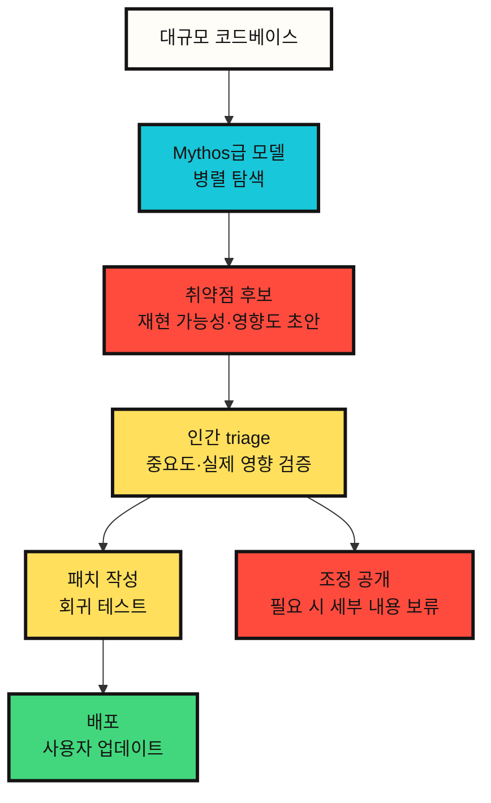

# Claude Mythos 5가 보안 산업에 던지는 질문

Claude Mythos 5를 보안 관점에서 보면, 가장 중요한 변화는 모델 성능 자체가 아니다. 더 큰 변화는 ==취약점을 찾고, 검증하고, 악용 가능성을 판단하는 비용 구조가 바뀌고 있다는 점==이다.

Anthropic은 Mythos Preview와 Mythos 5를 공개적으로 다룰 때 반복해서 같은 문제를 언급한다. 강한 모델은 방어자에게 도움이 되지만, 같은 능력은 공격자에게도 도움이 된다. 그래서 Mythos 5는 일반 공개가 아니라 Project Glasswing과 신뢰 기반 접근 프로그램을 통해 제한적으로 제공된다.

이 글은 Mythos 5를 "강한 보안 모델"이 아니라, **보안 운영 체계를 다시 설계하게 만드는 신호**로 본다.

## 왜 보안에서 특별한가

일반 코딩 모델은 코드를 읽고 수정한다. 보안 모델은 한 단계 더 간다. 코드를 읽고, 취약한 지점을 찾고, 그 취약점이 실제로 악용 가능한지 추론한다. 이 차이가 크다.

Anthropic의 Red Team 글과 시스템 카드에 따르면 Mythos 계열 모델은 기존 모델보다 취약점 발견과 익스플로잇 개발 과제에서 큰 차이를 보였다. 특히 Mythos Preview는 실제 오픈소스 코드베이스에서 알려지지 않았던 취약점을 찾고, 일부 경우에는 악용 가능성까지 분석한 사례로 소개되었다. Mythos 5 시스템 카드도 이 계열 능력이 계속 유지되거나 강화되었다고 설명한다.

이때 보안 산업이 봐야 할 핵심은 "AI가 해킹을 한다"는 자극적인 문장이 아니다. 더 정확한 문장은 다음에 가깝다.

==전문가가 오래 걸려 하던 취약점 조사와 악용 가능성 검토의 일부가, 모델 기반 병렬 탐색으로 바뀌고 있다.==

## 방어자에게 좋은 소식과 나쁜 소식

좋은 소식은 분명하다. 같은 모델을 방어자가 쓰면 오래된 코드, 복잡한 파서, 커널, 브라우저, 멀티미디어 라이브러리, 클라우드 기반 소프트웨어에서 숨어 있던 문제를 더 빨리 찾을 수 있다. Project Glasswing은 바로 이 방향을 겨냥한다.

나쁜 소식도 분명하다. 취약점 발견 속도가 올라가면 패치와 배포가 병목이 된다. Anthropic의 Glasswing 초기 업데이트는 이 문제를 직접 언급한다. 취약점 발견, 패치 작성, 사용자 배포 사이에는 원래도 긴 지연이 있었고, Mythos급 모델은 발견과 악용 가능성 검토의 비용을 낮추면서 이 지연의 위험을 키운다.

즉 보안 조직의 병목은 "찾기"에서 "처리하기"로 이동한다.

```text
과거 병목: 취약점을 충분히 빨리 찾지 못함
새 병목: 너무 많은 고품질 후보를 검증하고 패치하고 배포해야 함
```

## 운영 구조로 보면 이렇게 바뀐다



이 구조에서 모델은 최종 판정자가 아니다. 모델은 후보를 만들고, 재현 가능성을 높이고, 사람이 볼 수 있는 보고서 형태로 정리한다. 최종 판단은 여전히 인간 triage, 프로젝트 유지보수자, 보안팀, 배포 책임자가 맡아야 한다.

==Mythos급 모델의 가치는 인간을 대체하는 데보다, 인간이 검토해야 할 고품질 후보를 대량으로 만들어 내는 데 있다.==

## Exploit 평가가 의미하는 것

Anthropic Red Team은 Mythos Preview를 ExploitBench, ExploitGym, SCONE-bench 같은 평가와 연결해 설명했다. 여기서 중요한 것은 특정 공격 기법이 아니다. 중요한 것은 평가의 수준이다.

예전 평가는 "취약점이 존재함을 보여주는가"에 가까웠다. 더 어려운 평가는 "취약점을 실제 영향으로 이어지는 단계까지 발전시킬 수 있는가"를 본다. Anthropic은 Mythos Preview가 이런 종류의 평가에서 기존 모델보다 크게 앞섰다고 설명한다.

이 결과를 방어 관점에서 읽으면 다음과 같다.

==취약점 존재 여부와 실제 악용 가능성 사이의 간격이 줄어들고 있다.==

보안팀은 이제 "버그가 있다"와 "위험하다"를 더 빠르게 연결해야 한다. 취약점 후보를 단순히 목록으로 쌓는 것만으로는 부족하다. 영향도, 노출면, 패치 난이도, 우회 가능성, 배포 지연까지 함께 판단해야 한다.

## 공개 제한은 기능 제한이 아니라 위험 관리다

Mythos 5가 제한 접근으로 제공되는 이유는 단순히 상업적 희소성 때문이 아니다. Anthropic의 공식 설명은 사이버보안과 생물학 영역에서 이중용도 위험이 크기 때문에 접근을 제한한다고 말한다.

여기서 배포 방식이 중요하다. Fable 5는 같은 기반 모델에 안전장치를 붙여 일반 공개한다. 고위험 영역으로 분류되는 요청은 Claude Opus 4.8로 전환된다. Mythos 5는 일부 제한이 완화되지만 Project Glasswing 등 승인된 파트너 중심으로 제공된다.

이것은 보안 도구 배포의 새로운 형태다.

```text
강한 모델을 모두에게 공개한다
-> 위험 영역은 안전장치와 접근 심사로 나눈다
```

==앞으로 보안 모델의 차이는 성능보다 접근 계약, 감사 가능성, 데이터 보존, 사용 목적 검증으로 갈릴 가능성이 크다.==

## 방어자가 준비해야 할 것

Mythos급 모델이 더 넓게 등장하면 보안팀은 도구 하나를 추가하는 수준으로는 부족하다. 운영 체계 자체를 바꿔야 한다.

| 변화 | 필요한 대응 |
|---|---|
| 취약점 후보 증가 | 자동 분류, 중복 제거, 영향도 기준 triage |
| 악용 가능성 검토 가속 | 패치 우선순위와 배포 기한을 더 짧게 설정 |
| 오픈소스 유지보수자 부담 증가 | 보고 품질 기준, 재현 환경, 조정 공개 절차 정비 |
| 공격자 비용 하락 | 외부 노출면 축소, 패치 지연 감시, 취약 버전 재고 관리 |
| 모델 접근 제한 | 합법적 보안 연구자 검증 프로그램과 감사 로그 필요 |

특히 패치 배포가 중요하다. 모델이 취약점을 빨리 찾는다고 해서 사용자가 자동으로 안전해지는 것은 아니다. 패치가 만들어지고, 릴리스되고, 실제 사용자 환경에 적용되어야 한다. 그 사이의 시간이 길면 발견 속도 향상은 오히려 위험 창을 키운다.

## 내 판단

Mythos 5의 보안상 의미는 "AI가 공격자가 된다"가 아니다. 그것은 너무 거칠다. 더 정확한 판단은 이것이다.

==Mythos급 모델은 취약점 연구의 단가를 낮추고, 보안 조직의 병목을 발견에서 검증·패치·배포로 이동시킨다.==

이 변화는 보안 산업에 양면적이다. 방어자가 먼저 조직화하면 오래된 취약점을 대량으로 줄일 수 있다. 반대로 패치 체계가 느리고 유지보수자가 지친 생태계에서는, 모델이 만들어 내는 발견 속도가 공격자에게 더 유리하게 작용할 수 있다.

따라서 Mythos 5의 핵심 질문은 모델을 쓸 수 있느냐가 아니다. 더 중요한 질문은 이것이다.

==우리는 모델이 찾아낸 보안 지식을 실제 패치와 배포로 바꿀 운영 능력을 갖고 있는가.==

## Sources

- [Anthropic, Claude Fable 5 and Claude Mythos 5](https://www.anthropic.com/news/claude-fable-5-mythos-5)
- [Anthropic, Claude Mythos 5 product page](https://www.anthropic.com/claude/mythos)
- [Anthropic, Project Glasswing](https://www.anthropic.com/glasswing)
- [Anthropic, Project Glasswing: An initial update](https://www.anthropic.com/research/glasswing-initial-update)
- [Anthropic, Expanding Project Glasswing](https://www.anthropic.com/news/expanding-project-glasswing)
- [Anthropic Red Team, Assessing Claude Mythos Preview's cybersecurity capabilities](https://red.anthropic.com/2026/mythos-preview/)
- [Anthropic Red Team, Measuring LLMs' ability to develop exploits](https://red.anthropic.com/2026/exploit-evals/)
- [Anthropic, System Card: Claude Fable 5 & Claude Mythos 5](https://www-cdn.anthropic.com/d00db56fa754a1b115b6dd7cb2e3c342ee809620.pdf)
