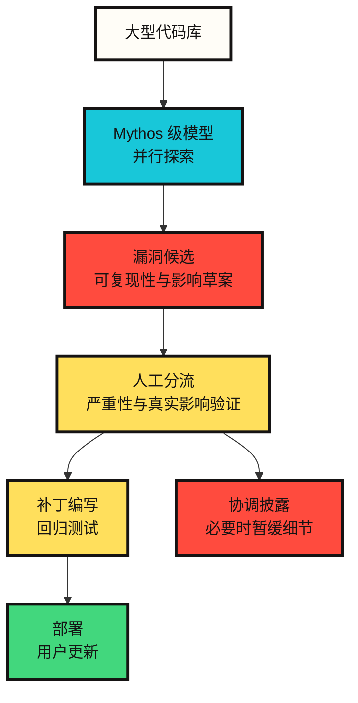

# Claude Mythos 5 给安全行业提出的问题

从安全角度看 Claude Mythos 5，最重要的变化不是模型性能本身。更大的变化是，==发现漏洞、验证漏洞、判断可利用性的成本结构正在改变==。

Anthropic 在公开讨论 Mythos Preview 和 Mythos 5 时，反复提到同一个问题。强模型可以帮助防御者，但同样的能力也可以帮助攻击者。因此 Mythos 5 不是普通公开模型，而是通过 Project Glasswing 和基于信任的访问计划进行有限提供。

本文不把 Mythos 5 视为一个“强大的安全模型”，而是把它看成 **重新设计安全运营体系的信号**。

## 为什么它在安全领域特别重要

普通代码模型会阅读和修改代码。安全模型会再往前一步。它会阅读代码、找到脆弱点，并推理这些脆弱点是否真的可以被利用。这个差异很大。

根据 Anthropic Red Team 的文章和系统卡，Mythos 系列模型在漏洞发现和漏洞利用开发任务上明显领先于既有模型。尤其是 Mythos Preview 被介绍为曾在真实开源代码库中发现此前未知的漏洞，并在部分案例中分析了可利用性。Mythos 5 系统卡也说明，这一类能力仍然存在或已经加强。

安全行业真正应该关注的，不是“AI 会黑客攻击”这种刺激性的说法。更准确的表述接近下面这句话。

==过去需要专家长时间完成的漏洞调查和可利用性评估，其中一部分正在转向由模型驱动的并行探索。==

## 对防御者来说的好消息和坏消息

好消息很明确。如果防御者使用同类模型，就能更快发现旧代码、复杂解析器、内核、浏览器、多媒体库和云软件中隐藏的问题。Project Glasswing 正是面向这个方向。

坏消息也很明确。如果漏洞发现速度提高，补丁和部署就会成为瓶颈。Anthropic 的 Glasswing 初期更新直接提到了这一点。漏洞发现、补丁编写、用户部署之间原本就存在很长延迟。Mythos 级模型降低发现和可利用性评估的成本后，会放大这种延迟带来的风险。

也就是说，安全组织的瓶颈会从“发现问题”转移到“处理问题”。

```text
过去的瓶颈：不能足够快地发现漏洞
新的瓶颈：必须验证、修补并部署太多高质量候选漏洞
```

## 从运营结构看会这样变化



在这个结构中，模型不是最终裁判。模型负责生成候选、提高复现性，并整理成人类可以审阅的报告。最终判断仍然应该由人工分流、项目维护者、安全团队和部署负责人承担。

==Mythos 级模型的价值不在于替代人类，而在于大量生成需要人类审查的高质量候选。==

## 漏洞利用评测意味着什么

Anthropic Red Team 将 Mythos Preview 与 ExploitBench、ExploitGym、SCONE-bench 等评测联系起来说明。这里重要的不是某个具体攻击技巧，而是评测层级。

过去的评测更接近于“能否证明漏洞存在”。更难的评测则会看“能否把这个漏洞推进到产生实际影响的阶段”。Anthropic 表示，Mythos Preview 在这类评测上明显超过既有模型。

从防御角度阅读，含义如下。

==漏洞存在与实际可利用性之间的距离正在缩短。==

安全团队现在需要更快地把“有 bug”和“很危险”连接起来。仅仅堆积漏洞候选列表已经不够。必须同时判断影响、暴露面、补丁难度、绕过可能性和部署延迟。

## 限制访问不是功能限制，而是风险管理

Mythos 5 采用限制访问，并不只是因为商业稀缺性。Anthropic 的官方说明表示，由于网络安全和生物学领域的双重用途风险较高，因此需要限制访问。

这里的分发方式很重要。Fable 5 是在同一个底层模型上加入安全机制后面向公众发布的版本。被分类为高风险领域的请求会被切换到 Claude Opus 4.8。Mythos 5 放宽了一些限制，但主要提供给 Project Glasswing 等已批准的合作伙伴。

这是安全工具分发的一种新形态。

```text
向所有人公开强模型
-> 通过安全机制和访问审查区分高风险领域
```

==未来安全模型之间的差异，可能不只取决于性能，而会更多取决于访问合约、可审计性、数据保留和使用目的验证。==

## 防御者应该准备什么

如果 Mythos 级模型更广泛地出现，安全团队不能只是多加一个工具。必须改变工具周围的运营体系。

| 变化 | 需要的应对 |
|---|---|
| 漏洞候选增加 | 自动分类、去重、基于影响的分流 |
| 可利用性评估加速 | 更短的补丁优先级周期和部署期限 |
| 开源维护者负担增加 | 报告质量标准、可复现环境、协调披露流程 |
| 攻击者成本下降 | 缩小外部暴露面、监控补丁延迟、盘点脆弱版本 |
| 模型访问受限 | 合法安全研究者验证计划和审计日志 |

尤其重要的是补丁部署。模型快速发现漏洞，并不意味着用户会自动变安全。补丁必须被编写、发布，并真正应用到用户环境中。如果这个间隔很长，发现速度提升反而会扩大风险窗口。

## 我的判断

Mythos 5 的安全意义不是“AI 成为攻击者”。这太粗糙。更准确的判断是：

==Mythos 级模型降低了漏洞研究的单位成本，并把安全组织的瓶颈从发现转移到验证、修补和部署。==

这个变化具有两面性。如果防御者先组织起来，就能大规模减少旧漏洞。相反，在补丁体系缓慢、维护者疲惫的生态中，模型带来的发现速度可能更有利于攻击者。

因此，围绕 Mythos 5 的核心问题不是我们能不能使用这个模型。更重要的问题是：

==我们是否具备把模型发现的安全知识转化为真实补丁和部署的运营能力。==

## Sources

- [Anthropic, Claude Fable 5 and Claude Mythos 5](https://www.anthropic.com/news/claude-fable-5-mythos-5)
- [Anthropic, Claude Mythos 5 product page](https://www.anthropic.com/claude/mythos)
- [Anthropic, Project Glasswing](https://www.anthropic.com/glasswing)
- [Anthropic, Project Glasswing: An initial update](https://www.anthropic.com/research/glasswing-initial-update)
- [Anthropic, Expanding Project Glasswing](https://www.anthropic.com/news/expanding-project-glasswing)
- [Anthropic Red Team, Assessing Claude Mythos Preview's cybersecurity capabilities](https://red.anthropic.com/2026/mythos-preview/)
- [Anthropic Red Team, Measuring LLMs' ability to develop exploits](https://red.anthropic.com/2026/exploit-evals/)
- [Anthropic, System Card: Claude Fable 5 & Claude Mythos 5](https://www-cdn.anthropic.com/d00db56fa754a1b115b6dd7cb2e3c342ee809620.pdf)
