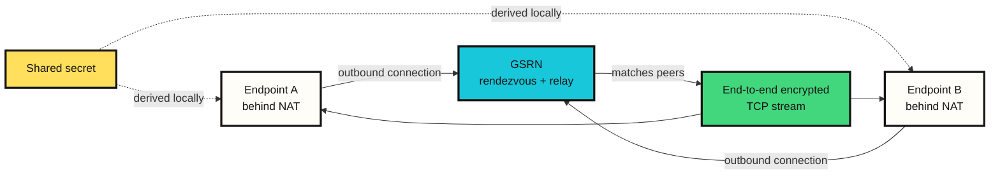
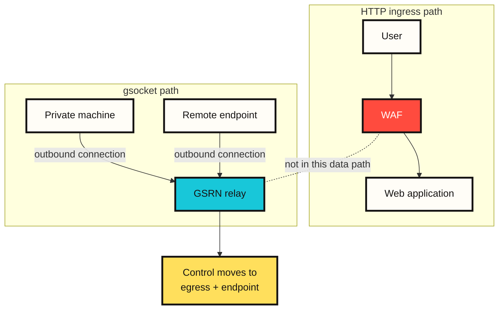
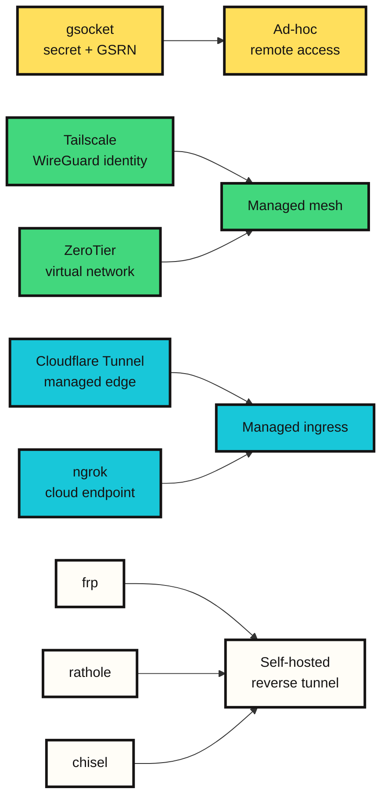

# How gsocket connects machines behind firewalls

At first glance, gsocket can look like a tool that "breaks through firewalls." The official site also leads with the idea of connecting as if there were no firewall. From a security perspective, however, the more precise explanation is different.

gsocket does not hack through a web application firewall (WAF). It creates a separate TCP path through outbound relay connections, without using the HTTP path where the WAF is placed. That can look like WAF bypass, but in practice the path itself has changed.

This distinction matters. It determines whether gsocket should be treated as an operational connectivity tool or as a risky unofficial remote access path.

## Short explanation

gsocket, more precisely Global Socket, is a TCP connectivity tool that allows two programs behind NAT or firewalls to communicate without knowing each other's direct address.

A normal connection is based on an address and a port.

```text
IP address + port + firewall rule -> connection
```

gsocket changes that model.

```text
shared secret + outbound relay connection -> connection
```

Both endpoints know the same secret, and both create outbound connections to the Global Socket Relay Network (GSRN). The relay network matches the two endpoints. After that, an encrypted TCP stream is formed between them.

In plain terms:

```text
Two machines that do not know each other's address
carry the same passphrase
go to the same meeting point
and find each other there.
```

The passphrase is the connection key, the meeting point is the GSRN, and the process of finding each other is the rendezvous.



## Terms

| Term | Meaning |
|---|---|
| Endpoint | A program or machine at either end of a connection |
| NAT | Network address translation that hides private IP addresses behind a public address |
| Firewall | A control point that allows or blocks inbound and outbound traffic according to policy |
| WAF | A web application firewall that inspects HTTP requests |
| Relay | A server or network that forwards traffic between two endpoints |
| GSRN | Global Socket Relay Network, the relay infrastructure used by gsocket endpoints |
| Rendezvous | The process by which endpoints that do not know each other's direct address find each other at an intermediate point |
| Shared secret | A connection secret known by both endpoints |
| End-to-end encryption | Encryption between endpoints so that the relay cannot read payloads in plaintext |
| Egress | Traffic leaving an internal network toward the internet |
| Unofficial remote access | Remote access that exists outside approved VPN, bastion, or management systems |

## Not WAF bypass, but path bypass

A WAF usually inspects HTTP requests entering a web application.

```text
user -> WAF -> web application
```

The gsocket model is different.

```text
private machine -> Global Socket Relay Network <- remote endpoint
```

The private machine does not open an inbound port. Instead, it creates an outbound connection to an external relay network. The remote endpoint connects to the same relay network. The two sides find each other through the same secret and then create an encrypted TCP stream.

The WAF does not see this traffic because the WAF was not broken. The traffic simply does not pass through the HTTP ingress path where the WAF sits. To control this problem, egress control, endpoint process control, and remote access governance matter more than WAF rules.



## Rendezvous: finding each other through the same secret

In networking, rendezvous is the process where two endpoints that do not know each other's direct address, or cannot directly connect, meet at an intermediate point and establish a connection.

For gsocket, that intermediate point is the Global Socket Relay Network, or GSRN. The official README describes GSRN as a free cloud service that connects TCP pipes. Endpoints do not need to know each other's IP address or port. They only need to know the same secret.

```text
Endpoint A behind NAT
  -> outbound connection to GSRN

Endpoint B behind NAT
  -> outbound connection to GSRN

Shared secret
  -> locally derives rendezvous identity and session material

GSRN
  -> matches both endpoints
  -> relays encrypted traffic
```

According to the official README, the secret does not leave the workstation. The session key and ID are derived locally. GSRN relays traffic, but the payload is end-to-end encrypted.

The structure can be summarized in one sentence:

```text
gsocket is a relay-mediated TCP connection model that treats a shared secret as an access capability.
```

## Is GSRN like Tor?

GSRN is relay infrastructure, but it should not be treated as a Tor-like volunteer relay network. Tor is a multi-hop onion routing network designed for anonymity, and many of its relays are operated by volunteers. In the official gsocket material, GSRN is closer to a free cloud service.

The similarity is limited to the use of intermediate relays. The goal is different.

| Area | gsocket GSRN | Tor |
|---|---|---|
| Main purpose | Connecting endpoints behind NAT/firewalls | Anonymity and onion routing |
| Connection basis | Shared secret | Onion circuit |
| Relay model | GSRN cloud relay | Volunteer relay network |
| Path | Relay-mediated TCP stream | Multi-hop onion path |
| Security focus | Secret lifetime, endpoint process, egress audit | Anonymity set, exit node, circuit isolation |

gsocket supports a Tor option, but that does not mean gsocket itself is a Tor-like network.

## The secret is an access capability

In gsocket, the secret is more than an authentication string. Whoever knows the secret can establish the connection. In practice, the secret is the access capability.

That view makes the risk clearer.

| Design element | Benefit | Risk |
|---|---|---|
| Shared secret | Connection without address and port exposure | Endpoint exposure if the secret leaks |
| Outbound relay | No inbound firewall rule needed | Unofficial access through egress traffic |
| End-to-end encryption | The relay cannot easily read payloads | Endpoint compromise and process audit issues remain |
| Tool composition | Can combine with SSH, file transfer, proxy, or VPN models | Can be misused as remote shell, proxy pivot, or persistent execution |

Safe use of gsocket should start with these questions.

```text
Who approved this connection?
Which machine is being exposed?
How long does the secret live?
What capability is actually opened: shell, file transfer, or web preview?
Are egress traffic and process lifetime recorded?
Is cleanup verified after the session ends?
```

## How this public article handles commands

Official gsocket examples include powerful dual-use features related to remote shells, SSH exposure, resident execution and watchdog processes, proxies, file transfer, and VPN tunnels. This article does not reproduce those execution commands.

That choice is not an attempt to avoid technical depth. Once separated from context, command lines can become a backdoor procedure. What a public article should preserve is the analysis frame, not the command recipe.

This article therefore treats the feature groups as follows.

| Feature group | Legitimate use | Risk |
|---|---|---|
| Temporary service forwarding | Previewing a private development service | Unapproved service exposure |
| File transfer | Moving artifacts between owned endpoints | Data movement path |
| Remote support | Temporary troubleshooting of a machine behind NAT | Unaudited remote shell |
| Proxy or tunnel | Lab routing test | Private network pivot |
| Resident session | Emergency reconnection for break-glass recovery | Persistent execution |

Operational documentation should start with guardrails before commands.

## How it differs from similar tools

Many tools look similar to gsocket, but they do not all solve the same problem.



| Tool | Core model | Difference from gsocket |
|---|---|---|
| Tailscale | WireGuard-based tailnet, direct UDP connection, DERP relay fallback | Long-lived managed mesh centered on identity, ACLs, and device auth |
| ZeroTier | P2P VL1 and Ethernet virtualization VL2 | Focused on virtual networks and controller membership |
| Cloudflare Tunnel | `cloudflared` creates an outbound tunnel to Cloudflare edge | Managed ingress combined with access policy and identity providers |
| ngrok | Local agent creates a tunnel to an ngrok cloud endpoint | Developer preview, public endpoint, traffic inspection, and policy features |
| frp | Self-hosted reverse proxy | User operates the relay server directly |
| rathole | Rust-based self-hosted reverse proxy | Alternative to frp/ngrok with explicit server/client topology |
| chisel | TCP/UDP tunnels over HTTP transport, protected by SSH | HTTP-friendly tunnel with a self-operated server endpoint |
| gsocket | Shared secret + GSRN relay | Ad-hoc access capability; governance must be designed separately |

The selection criteria are straightforward.

| Goal | Suitable tools |
|---|---|
| One-off lab connection | gsocket |
| Long-lived private mesh | Tailscale, ZeroTier |
| Public web or app exposure | Cloudflare Tunnel, ngrok |
| Reverse proxy on your own VPS | frp, rathole |
| TCP tunnel where only HTTP can leave | chisel, ngrok, Cloudflare Tunnel |
| Production network requiring SSO, audit, and policy | Tailscale, Cloudflare Tunnel, ZeroTier |

gsocket has a low barrier to entry. That is both its strength and its risk.

## Defensive checklist

When analyzing gsocket-like tools defensively, look at egress and endpoints rather than only inbound firewalls.

```text
unknown long-lived outbound connection
unexpected gsocket or tunnel binary
secret left in shell history or configuration files
service exposed without bastion or VPN record
daemon, watchdog, cron, or launch agent registration
proxy, mount, file transfer, or tunnel interface
Tor or proxy relay configuration
```

A practical response sequence:

1. Confirm the machine owner and approval record.
2. Capture process tree, binary path, hash, environment variables, and open sockets.
3. Revoke or rotate the secret and related accounts.
4. Check systemd, launchd, cron, shell rc files, and container entrypoints.
5. Review private network flow and file movement traces.
6. After ending the session, verify recurrence through reboot or service restart.

## Conclusion

gsocket is not a tool that "breaks through the WAF." More precisely, it does not use the HTTP path observed by the WAF. It creates a separate TCP connection path using a shared secret and relay infrastructure.

It is a useful connectivity primitive. It can quickly solve problems such as lab machines behind NAT, temporary support, private workers, and file transfer. The same structure, however, becomes unofficial remote access when combined with long-lived secrets, resident execution, and proxy pivots.

The central question for gsocket is therefore not "can we use it?" but "under what governance should we use it?"

```text
The secret is an access capability.
The relay changes the path.
Egress is the new boundary.
The endpoint process is the real control point.
```

## Sources

- https://github.com/hackerschoice/gsocket
- https://www.gsocket.io/
- https://tailscale.com/docs/reference/connection-types
- https://docs.zerotier.com/protocol/
- https://developers.cloudflare.com/cloudflare-one/networks/connectors/cloudflare-tunnel/
- https://ngrok.com/docs/agent
- https://github.com/fatedier/frp
- https://github.com/jpillora/chisel
- https://github.com/rathole-org/rathole
