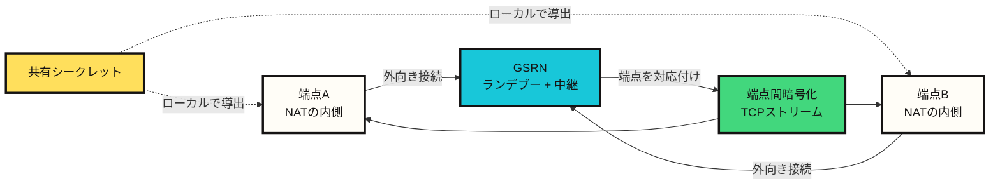
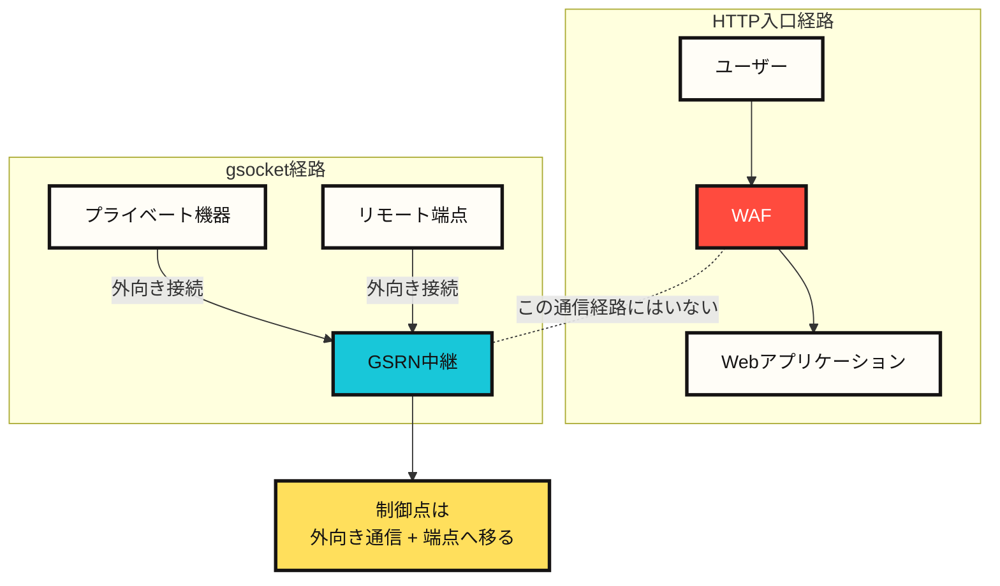
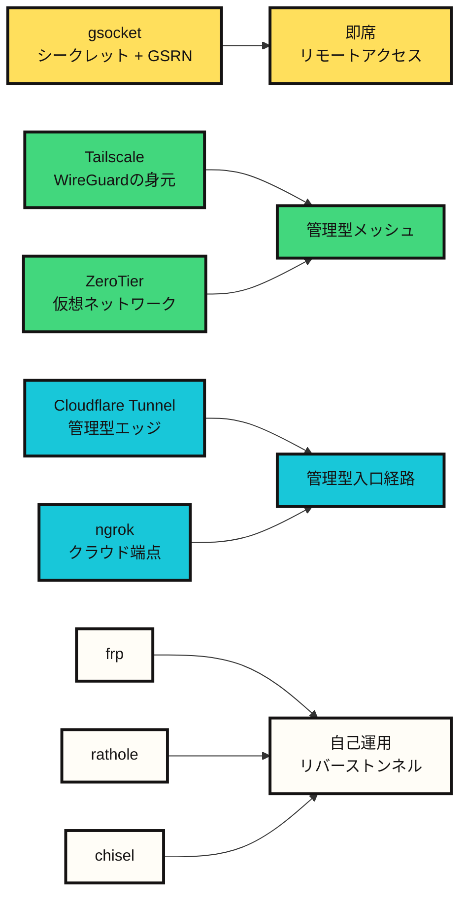

# gsocketはファイアウォールの内側にある機器をどう接続するのか

gsocketを初めて見ると、「ファイアウォールを突破するツール」のように見える。公式サイトも「ファイアウォールがないかのように接続する」という表現を前面に出している。しかし、セキュリティの観点では、より正確な説明は少し違う。

gsocketはWebアプリケーションファイアウォール(WAF)を攻撃して通過する道具ではない。WAFが置かれているHTTP経路を使わず、外向きの中継接続によって別のTCP経路を作る道具に近い。そのためWAF回避のように見えることはあるが、実際には通信経路そのものが変わっている。

この違いを理解しないと、gsocketを運用上の接続ツールとして扱うべきか、危険な非公式リモートアクセス経路として扱うべきかを判断できない。

## gsocketの短い説明

gsocket、正確にはGlobal Socketは、NATやファイアウォールの内側にある二つのプログラムが、相手の直接アドレスを知らなくても通信できるようにするTCP接続ツールである。

通常の接続はアドレスとポートに基づく。

```text
IPアドレス + ポート + ファイアウォール規則 -> 接続
```

gsocketはこのモデルを変える。

```text
共有シークレット + 外向き中継接続 -> 接続
```

両方の端点が同じシークレットを知っており、どちらもGlobal Socket Relay Network(GSRN)へ外向き接続を作ると、中継網が二つの端点を対応付ける。その後、端点間に暗号化されたTCPストリームが作られる。

平たく言えば、次のような仕組みである。

```text
互いの住所を知らない二つの機器が
同じ合言葉を持って
同じ待ち合わせ場所へ行き
そこで互いを見つけて通信する。
```

ここで合言葉が接続の鍵であり、待ち合わせ場所がGSRN、互いを見つける過程がランデブー(rendezvous)である。



## 用語

| 用語 | 意味 |
|---|---|
| 端点(endpoint) | 接続の両端にあるプログラムまたは機器 |
| NAT | プライベートIPをパブリックIPの背後に隠すネットワークアドレス変換 |
| ファイアウォール | 内向きまたは外向き通信をポリシーに従って許可・遮断する制御点 |
| WAF | HTTPリクエストを検査するWebアプリケーションファイアウォール |
| 中継(relay) | 二つの端点の通信を途中で転送するサーバーまたはネットワーク |
| GSRN | Global Socket Relay Network。gsocketの端点が接続する中継インフラ |
| ランデブー(rendezvous) | 互いの直接アドレスを知らない端点が中間地点で互いを見つける過程 |
| 共有シークレット | 両方の端点が知っている接続用の秘密値 |
| 端点間暗号化 | 中継サーバーがペイロードを平文で読めないように端点間で暗号化する方式 |
| 外向き通信(egress) | 内部ネットワークからインターネットへ出ていく通信 |
| 非公式リモートアクセス | 承認済みVPN、踏み台、管理システムの外側に作られるリモートアクセス経路 |

## WAF回避ではなく経路回避

WAFは通常、Webアプリケーションに入ってくるHTTPリクエストを検査する。

```text
ユーザー -> WAF -> Webアプリケーション
```

gsocketのモデルはこの流れとは異なる。

```text
プライベート機器 -> Global Socket中継網 <- リモート端点
```

プライベート機器は内向きポートを開かない。その代わりに外部の中継網へ外向き接続を作る。リモート端点も同じ中継網へ接続する。両者は同じシークレットを基準に中継網で互いを見つけ、その後に暗号化されたTCPストリームを作る。

WAFがこの通信を見ない理由は、WAFが突破されたからではない。その通信が、WAFの置かれたHTTP入口経路をそもそも通らないからである。この問題を制御するには、WAFルールよりも、外向き通信の制御、端点プロセスの制御、リモートアクセスの承認体系が重要になる。



## ランデブー: 同じシークレットで互いを見つける

ネットワークにおけるランデブーとは、互いの直接アドレスを知らない、または直接接続できない二つの端点が、中間地点で互いを見つけて接続を成立させる過程である。

gsocketでは、この中間地点がGlobal Socket Relay Network、つまりGSRNである。公式READMEでは、GSRNはTCPパイプを接続する無料クラウドサービスとして説明されている。端点は相手のIPアドレスやポートを知る必要がない。両方が同じシークレットを知っていればよい。

```text
NATの内側にある端点A
  -> GSRNへ外向き接続

NATの内側にある端点B
  -> GSRNへ外向き接続

共有シークレット
  -> ランデブー用IDとセッション材料をローカルで導出

GSRN
  -> 二つの端点を対応付ける
  -> 暗号化された通信を中継する
```

公式READMEによれば、シークレットは作業機器の外へ出ない。セッションキーとIDはローカルで導出される。GSRNは通信を中継するが、ペイロードは端点間で暗号化される。

この構造は一文でまとめられる。

```text
gsocketは、共有シークレットをアクセス権限として扱う中継型TCP接続モデルである。
```

## GSRNはTorなのか

GSRNは中継インフラである。ただし、Torのようなボランティア型中継ネットワークと見るべきではない。Torは匿名性を目的とする多段のオニオンルーティングネットワークであり、多くの中継ノードはボランティアによって運用されている。gsocketのGSRNは、公式資料上は無料クラウドサービスに近い。

似ている点は「中間中継を使う」ことに限られる。目的は異なる。

| 項目 | gsocket GSRN | Tor |
|---|---|---|
| 主目的 | NAT/ファイアウォールの内側にある端点の接続 | 匿名性とオニオンルーティング |
| 接続の基準 | 共有シークレット | オニオン回線 |
| 中継モデル | GSRNクラウド中継 | ボランティア型中継ネットワーク |
| 経路 | 中継型TCPストリーム | 多段オニオン経路 |
| セキュリティ上の関心 | シークレットの寿命、端点プロセス、外向き通信監査 | 匿名性集合、出口ノード、回線分離 |

gsocketはTorオプションをサポートしているが、それはgsocket自体がTorのようなネットワークであるという意味ではない。

## シークレットはアクセス権限である

gsocketにおいて、シークレットは単なる認証文字列を超えている。シークレットを知っている側は接続を成立させられる。実質的に、シークレットそのものがアクセス権限である。

この見方をするとリスクが明確になる。

| 設計要素 | 利点 | リスク |
|---|---|---|
| 共有シークレット | アドレスやポートを公開せずに接続できる | シークレット漏えい時に端点が露出する |
| 外向き中継 | 内向きファイアウォール規則が不要 | 外向き通信を使った非公式アクセスになる |
| 端点間暗号化 | 中継サーバーがペイロードを読みづらい | 端点侵害とプロセス監査の問題は残る |
| 既存ツールとの組み合わせ | SSH、ファイル転送、プロキシ、VPNモデルと組み合わせられる | リモートシェル、プロキシ経由の迂回路、常駐実行に悪用される |

gsocketを安全に使うなら、最初に次の問いが必要になる。

```text
この接続は誰が承認したのか。
どの機器が露出しているのか。
シークレットはどれくらいの期間有効なのか。
実際に開かれる権限はシェル、ファイル転送、Webプレビューのどれなのか。
外向き通信とプロセスの寿命は記録されているのか。
セッション終了後の後片付けは確認されたのか。
```

## この公開記事でコマンドを扱う方針

公式のgsocket例には、リモートシェル、SSH公開、常駐実行と監視プロセス、プロキシ、ファイル転送、VPNトンネルに関する強いデュアルユース機能が含まれる。この記事では、それらの実行コマンドを再掲しない。

これは技術的な深さを避けるためではない。文脈から切り離されたコマンド列は、そのままバックドア手順になり得る。公開記事で残すべきものは、コマンドのレシピではなく分析の枠組みである。

そのため、この記事では機能群を次のように扱う。

| 機能群 | 正当な用途 | リスク |
|---|---|---|
| 一時的なサービス転送 | プライベートな開発サービスのプレビュー | 承認されていないサービス公開 |
| ファイル転送 | 所有する端点間での成果物移動 | データ移動経路 |
| リモート支援 | NATの内側にある機器の一時的な調査 | 監査されないリモートシェル |
| プロキシまたはトンネル | 実験ネットワークの経路テスト | プライベートネットワークへの迂回路 |
| 常駐セッション | 非常時復旧のための自動再接続 | 常駐実行 |

運用文書では、コマンドより先に安全装置を書くべきである。

## 類似ツールとの差分

gsocketに似たツールは多い。しかし、すべてが同じ問題を解いているわけではない。



| ツール | 基本モデル | gsocketとの差分 |
|---|---|---|
| Tailscale | WireGuardベースのtailnet、直接UDP接続、DERP中継のフォールバック | 身元、ACL、デバイス認証を中心とする長期運用メッシュ |
| ZeroTier | P2P VL1とイーサネット仮想化VL2 | 仮想ネットワークとコントローラーメンバーシップが中心 |
| Cloudflare Tunnel | `cloudflared`がCloudflareエッジへ外向きトンネルを作る | アクセスポリシーとIDプロバイダーに結合した管理型入口経路 |
| ngrok | ローカルエージェントがngrokクラウド端点へトンネルを作る | 開発プレビュー、公開端点、通信検査、ポリシー機能が中心 |
| frp | 自己運用のリバースプロキシ | 利用者が中継サーバーを直接運用する |
| rathole | Rustベースの自己運用リバースプロキシ | frp/ngrokの代替で、サーバー/クライアント構造が明確 |
| chisel | HTTP転送上のTCP/UDPトンネルをSSHで保護 | HTTPに通しやすいトンネルで、サーバー端点を自己運用する |
| gsocket | 共有シークレット + GSRN中継 | 即席のアクセス権限が中心で、統制設計は別途必要 |

選択基準は明確である。

| 目的 | 適したツール |
|---|---|
| 単発の実験ネットワーク接続 | gsocket |
| 長期のプライベートメッシュ | Tailscale, ZeroTier |
| 公開Webまたはアプリの公開 | Cloudflare Tunnel, ngrok |
| 自前VPS上のリバースプロキシ | frp, rathole |
| HTTPしか外へ出られない環境のTCPトンネル | chisel, ngrok, Cloudflare Tunnel |
| SSO、監査、ポリシーが重要な運用ネットワーク | Tailscale, Cloudflare Tunnel, ZeroTier |

gsocketは導入の敷居が低い。そこが利点であり、同時にリスクでもある。

## 防御側のチェックリスト

gsocket系ツールを防御的に分析する場合、内向きファイアウォールだけでなく、外向き通信と端点を見る必要がある。

```text
確認されていない長期の外向き接続
想定外のgsocketまたはトンネル実行ファイル
シークレットがシェル履歴や設定ファイルに残っている
踏み台またはVPN記録なしに公開されたサービス
daemon、watchdog、cron、launch agentの登録
プロキシ、マウント、ファイル転送、トンネルインターフェース
Torまたはプロキシ中継設定
```

実務上の対応順序は次の通りである。

1. 機器の担当者と承認記録を確認する。
2. プロセスツリー、実行ファイルのパス、ハッシュ、環境変数、開いているソケットを取得する。
3. シークレットと関連アカウントを失効またはローテーションする。
4. systemd、launchd、cron、shell rc、container entrypointを確認する。
5. プライベートネットワーク区間の通信の流れとファイル移動の痕跡を確認する。
6. セッション終了後、再起動またはサービス再起動で再発有無を確認する。

## 結論

gsocketは「WAFを突破するツール」ではない。より正確には、WAFが見ているHTTP経路を使わず、共有シークレットと中継インフラを利用して別のTCP接続経路を作るツールである。

それ自体は有用な接続プリミティブである。NATの内側にある実験機器、一時的な支援、プライベートな作業機器、ファイル転送といった問題を素早く解決できる。しかし同じ構造が、長期シークレット、常駐実行、プロキシ経由の迂回路と結び付くと、非公式リモートアクセスになる。

したがってgsocketの中心的な問いは、「使えるか」ではなく「どのような統制の下で使うか」である。

```text
シークレットはアクセス権限である。
中継は経路を変える。
外向き通信が新しい境界である。
端点プロセスが実際の制御点である。
```

## Sources

- https://github.com/hackerschoice/gsocket
- https://www.gsocket.io/
- https://tailscale.com/docs/reference/connection-types
- https://docs.zerotier.com/protocol/
- https://developers.cloudflare.com/cloudflare-one/networks/connectors/cloudflare-tunnel/
- https://ngrok.com/docs/agent
- https://github.com/fatedier/frp
- https://github.com/jpillora/chisel
- https://github.com/rathole-org/rathole
