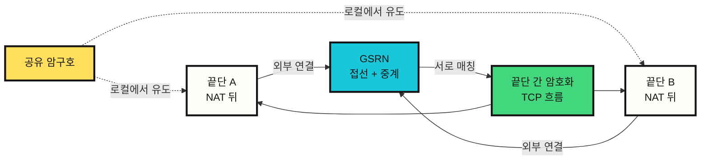
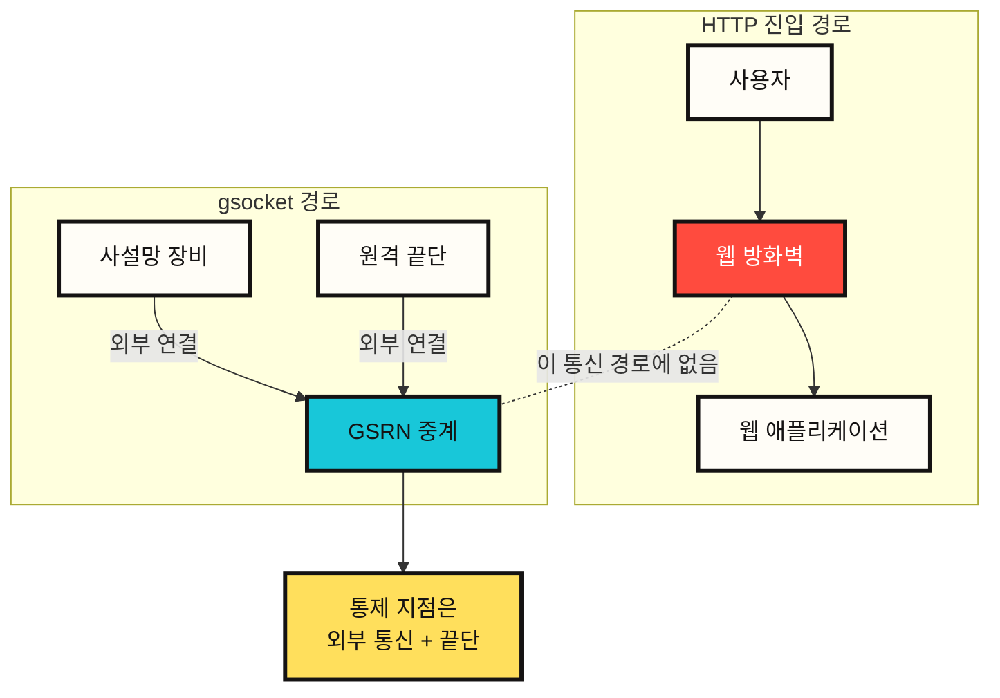
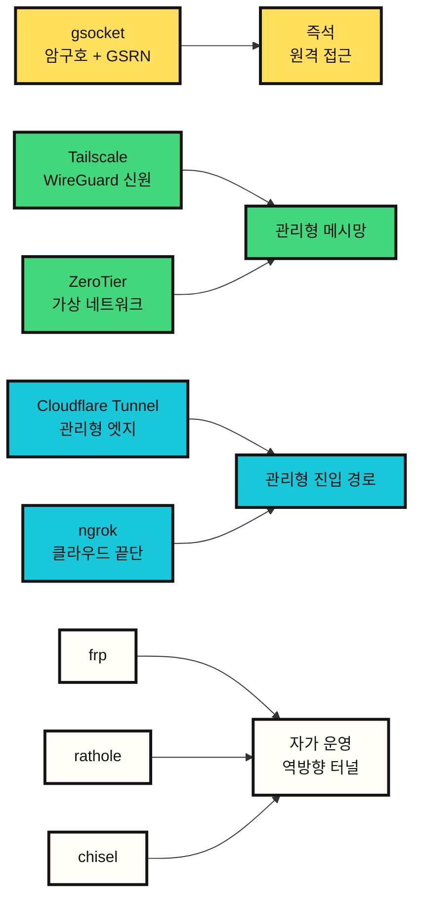

# gsocket은 어떻게 방화벽 뒤의 장비를 연결하는가

gsocket을 처음 보면 "방화벽을 뚫는 도구"처럼 보인다. 공식 사이트도 "방화벽이 없는 것처럼 연결한다"는 문장을 전면에 둔다. 하지만 보안적으로 더 정확한 설명은 다르다.

gsocket은 웹 방화벽(WAF)을 해킹해서 통과하는 도구가 아니다. gsocket은 **웹 방화벽이 놓인 HTTP 경로를 사용하지 않고, 외부 중계 기반의 별도 TCP 경로를 만드는 도구**에 가깝다. 그래서 웹 방화벽 우회처럼 보일 수 있지만, 실제로는 경로 자체를 바꾸는 것이다.

이 차이를 정확히 이해해야 gsocket을 운영 도구로 쓸지, 위험한 비공식 원격 접근 경로로 볼지 판단할 수 있다.

## gsocket 간략 설명

gsocket, 정확히는 Global Socket은 NAT나 방화벽 뒤에 있는 두 프로그램이 서로 직접 주소를 몰라도 통신할 수 있게 해주는 TCP 연결 도구다.

일반적인 접속은 주소와 포트를 기준으로 한다.

```text
IP 주소 + 포트 + 방화벽 규칙 -> 연결
```

gsocket은 이 모델을 바꾼다.

```text
공유 암구호 + 외부 중계 연결 -> 연결
```

즉 양쪽 끝단이 같은 암구호를 알고 있고, 둘 다 Global Socket 중계망(GSRN)으로 외부 연결을 만들면, 중계망이 두 끝단을 서로 맞춰 준다. 이후 두 끝단 사이에는 암호화된 TCP 흐름이 만들어진다.

쉽게 말하면 다음과 같다.

```text
서로 주소를 모르는 두 장비가
같은 암구호를 들고
같은 접선 장소에 가서
서로를 찾아 통신하는 방식
```

여기서 암구호가 연결 열쇠이고, 접선 장소가 `GSRN`, 서로를 찾는 과정이 `rendezvous`다.



## 용어 설명

| 용어 | 의미 |
|---|---|
| 끝단(endpoint) | 연결의 양 끝에 있는 프로그램이나 장비 |
| NAT | 사설 IP를 공인 IP 뒤에 숨기는 네트워크 주소 변환 장치 |
| 방화벽(firewall) | 안으로 들어오거나 밖으로 나가는 통신을 정책에 따라 허용하거나 차단하는 장치 |
| 웹 방화벽(WAF) | HTTP 요청을 검사하는 웹 애플리케이션 방화벽 |
| 중계(relay) | 두 끝단 사이의 통신을 중간에서 전달하는 서버 또는 네트워크 |
| GSRN | Global Socket Relay Network. gsocket 끝단이 접속하는 공식 중계 인프라 |
| 접선(rendezvous) | 서로 직접 주소를 모르는 끝단이 중간 지점에서 서로를 찾는 과정 |
| 공유 암구호 | 양쪽 끝단이 함께 알고 있는 연결용 암구호 |
| 끝단 간 암호화 | 중간 중계 서버가 본문 데이터를 평문으로 보지 못하도록 양 끝단 사이에서 암호화하는 방식 |
| 외부 통신(egress) | 내부망에서 외부 인터넷으로 나가는 통신 |
| 비공식 원격 접근 | 공식 VPN, 베스천, 관리 시스템 밖에서 생기는 승인되지 않은 원격 접근 경로 |

## 웹 방화벽 우회가 아니라 경로 우회

웹 방화벽은 보통 웹 애플리케이션으로 들어오는 HTTP 요청을 검사한다.

```text
사용자 -> WAF -> 웹 애플리케이션
```

gsocket의 모델은 이 흐름과 다르다.

```text
사설망 장비 -> Global Socket 중계망 <- 원격 끝단
```

사설망 장비는 내부로 들어오는 포트를 열지 않는다. 대신 외부 중계망으로 나가는 연결을 만든다. 원격 끝단도 같은 중계망에 접속한다. 양쪽은 같은 암구호를 기준으로 중계망에서 서로를 찾고, 이후 암호화된 TCP 흐름을 만든다.

따라서 웹 방화벽이 이 통신을 보지 못하는 이유는 웹 방화벽이 뚫렸기 때문이 아니다. 웹 방화벽이 배치된 HTTP 진입 경로를 아예 지나지 않기 때문이다. 이 문제를 막으려면 웹 방화벽 규칙보다 외부 통신 통제, 끝단 프로세스 통제, 원격 접근 승인 체계가 더 중요하다.



## 접선(rendezvous): 같은 암구호로 서로 찾기

네트워크에서 접선은 서로 직접 주소를 모르거나 직접 연결할 수 없는 두 끝단이 중간 지점에서 서로를 찾아 연결을 성립시키는 과정이다.

gsocket에서 이 중간 지점은 Global Socket 중계망, 즉 GSRN이다. 공식 README는 GSRN을 TCP 파이프를 연결하는 무료 클라우드 서비스로 설명한다. 끝단은 상대방의 IP 주소나 포트를 몰라도 된다. 둘 다 같은 암구호를 알고 있으면 된다.

```text
NAT 뒤 끝단 A
  -> GSRN으로 외부 연결

NAT 뒤 끝단 B
  -> GSRN으로 외부 연결

공유 암구호
  -> 접선용 식별값과 세션 재료를 로컬에서 유도

GSRN
  -> 두 끝단을 서로 매칭
  -> 암호화된 통신을 중계
```

공식 README 기준 암구호는 작업 장비를 떠나지 않고, 세션 키와 식별값은 로컬에서 유도된다. GSRN은 통신을 중계하지만 본문 데이터는 끝단 간 암호화된다.

이 구조를 한 문장으로 줄이면 다음과 같다.

```text
gsocket은 공유 암구호를 접근 권한처럼 쓰는 중계형 TCP 연결 방식이다.
```

## GSRN은 Tor인가

GSRN은 중계 인프라다. 다만 Tor와 같은 자원봉사자 기반 중계망으로 보기는 어렵다. Tor는 익명성을 목표로 하는 다중 경유 어니언 라우팅 네트워크이고, 많은 중계 노드가 자원봉사자 기반으로 운영된다. gsocket의 GSRN은 공식 문서상 무료 클라우드 서비스에 가깝다.

비슷한 점은 "중간 중계를 쓴다"는 정도다. 목적은 다르다.

| 항목 | gsocket GSRN | Tor |
|---|---|---|
| 주 목적 | NAT/방화벽 뒤 끝단 연결 | 익명성, 어니언 라우팅 |
| 연결 기준 | 공유 암구호 | 어니언 회선 |
| 중계 모델 | GSRN 클라우드 중계 | 자원봉사자 기반 중계망 |
| 경로 | 중계형 TCP 흐름 | 다중 경유 어니언 경로 |
| 보안 관심사 | 암구호 수명, 끝단 프로세스, 외부 통신 감사 | 익명성 집합, 출구 노드, 회선 분리 |

gsocket은 Tor 옵션을 지원하지만, 그 자체가 Tor와 같은 네트워크라는 뜻은 아니다.

## 암구호는 접근 권한이다

gsocket에서 암구호는 단순 인증 문자열을 넘어선다. 암구호를 아는 쪽은 연결을 성립시킬 수 있다. 따라서 암구호는 사실상 접근 권한 그 자체다.

이 관점에서 위험이 선명해진다.

| 설계 요소 | 장점 | 위험 |
|---|---|---|
| 공유 암구호 | 주소와 포트 없이 접속 가능 | 암구호 유출 시 끝단 노출 |
| 외부 중계 | 내부 진입 방화벽 규칙 불필요 | 외부 통신 기반의 비공식 접근 |
| 끝단 간 암호화 | 중계 서버가 본문 데이터를 보기 어려움 | 끝단 침해와 프로세스 감사 문제는 남음 |
| 기존 도구 결합 | SSH, 파일 전송, 프록시, VPN 모델과 결합 가능 | 원격 셸, 프록시 우회 경로, 지속 실행으로 오용 가능 |

따라서 gsocket을 안전하게 쓰려면 다음 질문이 먼저 나와야 한다.

```text
이 연결은 누가 승인했는가?
어떤 장비가 노출되는가?
암구호는 얼마나 오래 살아 있는가?
실제로 열리는 권한은 셸인가, 파일 전송인가, 웹 미리보기인가?
외부 통신과 프로세스 수명 주기가 기록되는가?
종료 후 정리가 확인되는가?
```

## 공개 글에서 명령을 다루는 방식

gsocket 공식 예시에는 원격 셸, SSH 노출, 상주 실행과 감시 프로세스, 프록시, 파일 전송, VPN 터널과 관련된 강한 양면적 기능군이 등장한다. 이 글은 그런 실행 명령을 복제하지 않는다.

이 결정은 기술적 깊이를 피하려는 것이 아니다. 명령 자체는 문맥을 제거하면 곧바로 백도어 절차가 된다. 공개 글에서 보존해야 할 것은 명령줄이 아니라 분석 프레임이다.

따라서 이 글은 기능군을 다음처럼 다룬다.

| 기능군 | 합법적 사용 | 위험 |
|---|---|---|
| 임시 서비스 전달 | 사설 개발 서비스 미리보기 | 승인 없는 서비스 노출 |
| 파일 전송 | 소유한 끝단 사이의 산출물 이동 | 데이터 반출입 경로 |
| 원격 지원 | NAT 뒤 장비의 일시적 문제 확인 | 감사 없는 원격 셸 |
| 프록시 또는 터널 | 실험망 라우팅 테스트 | 사설망 우회 경로 |
| 상주 세션 | 비상 복구용 자동 재연결 | 지속 실행 |

실무 문서에는 명령보다 안전장치가 먼저 들어가야 한다.

## 비슷한 도구들과의 차이

gsocket과 비슷한 도구는 많다. 하지만 모두 같은 문제를 푸는 것은 아니다.



| 도구 | 핵심 모델 | gsocket과의 차이 |
|---|---|---|
| Tailscale | WireGuard 기반 tailnet, 직접 UDP 연결, DERP 중계 예비 경로 | 신원, 접근 제어 목록, 장비 인증이 중심인 장기 운영 메시망 |
| ZeroTier | P2P VL1과 이더넷 가상화 VL2 | 가상 네트워크와 컨트롤러 멤버십이 중심 |
| Cloudflare Tunnel | `cloudflared`가 Cloudflare 엣지로 만드는 외부 터널 | 관리형 진입 경로, 접근 정책, 신원 공급자와 결합 |
| ngrok | 로컬 에이전트가 ngrok 클라우드 끝단으로 만드는 터널 | 개발 미리보기, 공개 끝단, 통신 검사, 정책 설정이 중심 |
| frp | 직접 운영하는 역방향 프록시 | 사용자가 중계 서버를 직접 운영 |
| rathole | Rust 기반의 직접 운영 역방향 프록시 | frp/ngrok 대안이며 서버/클라이언트 구조가 명확함 |
| chisel | HTTP 전송 위에 TCP/UDP 터널을 만들고 SSH로 보호 | HTTP 친화적인 터널이며 서버 끝단을 직접 운영 |
| gsocket | 공유 암구호 + GSRN 중계 | 즉석 접근 권한 중심이라 통제 체계를 직접 설계해야 함 |

선택 기준은 분명하다.

| 목적 | 적합한 도구 |
|---|---|
| 단발성 실험망 연결 | gsocket |
| 장기 사설 메시망 | Tailscale, ZeroTier |
| 공개 웹 또는 앱 노출 | Cloudflare Tunnel, ngrok |
| 자체 VPS 기반 역방향 프록시 | frp, rathole |
| HTTP만 나갈 수 있는 환경의 TCP 터널 | chisel, ngrok, Cloudflare Tunnel |
| SSO, 감사, 정책이 중요한 운영망 | Tailscale, Cloudflare Tunnel, ZeroTier |

gsocket은 진입 장벽이 낮다. 바로 이 점이 장점이자 위험이다.

## 방어 관점의 체크리스트

gsocket류 도구를 방어적으로 분석할 때는 내부 진입 방화벽보다 외부 통신과 끝단을 봐야 한다.

```text
확인되지 않은 장기 외부 연결
예상 밖의 gsocket 또는 터널 실행 파일
암구호가 셸 기록이나 설정 파일에 남아 있음
베스천 또는 VPN 기록 없이 노출된 서비스
데몬, 감시 프로세스, cron, launch agent 등록
프록시, 마운트, 파일 전송, 터널 인터페이스
Tor 또는 프록시 중계 설정
```

대응 순서는 다음과 같다.

1. 장비 담당자와 승인 기록을 확인한다.
2. 프로세스 트리, 실행 파일 경로, 해시, 환경 변수, 열린 소켓을 캡처한다.
3. 암구호와 관련 계정을 회수하거나 회전한다.
4. systemd, launchd, cron, shell rc, container entrypoint를 확인한다.
5. 사설망 구간의 연결 흐름과 파일 이동 흔적을 검토한다.
6. 세션 종료 후 재부팅 또는 서비스 재시작으로 재발 여부를 확인한다.

## 결론

gsocket은 "웹 방화벽을 뚫는 도구"가 아니다. 더 정확히는 웹 방화벽이 보는 HTTP 경로를 쓰지 않고, 공유 암구호와 중계 인프라를 이용해 별도의 TCP 연결 경로를 만드는 도구다.

그 자체는 유용한 기본 연결 도구다. NAT 뒤 실험용 장비, 임시 지원, 사설 작업 장비, 파일 전송 같은 문제를 빠르게 해결할 수 있다. 하지만 같은 구조가 장기 암구호, 상주 실행, 프록시 우회 경로와 결합되면 비공식 원격 접근이 된다.

따라서 gsocket의 핵심 질문은 "쓸 수 있느냐"가 아니라 "어떤 통제 체계 안에서 쓸 것인가"다.

```text
암구호는 접근 권한이다.
중계는 경로를 바꾼다.
외부 통신이 새로운 경계다.
끝단 프로세스가 실제 통제 지점이다.
```

## Sources

- https://github.com/hackerschoice/gsocket
- https://www.gsocket.io/
- https://tailscale.com/docs/reference/connection-types
- https://docs.zerotier.com/protocol/
- https://developers.cloudflare.com/cloudflare-one/networks/connectors/cloudflare-tunnel/
- https://ngrok.com/docs/agent
- https://github.com/fatedier/frp
- https://github.com/jpillora/chisel
- https://github.com/rathole-org/rathole
