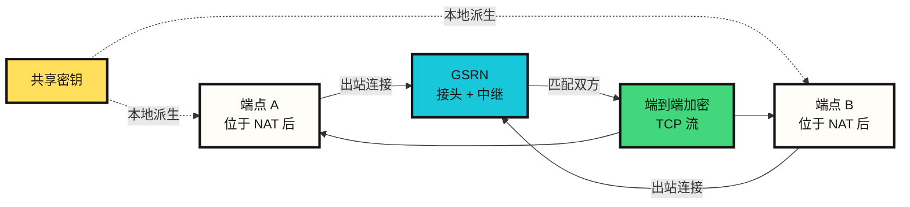
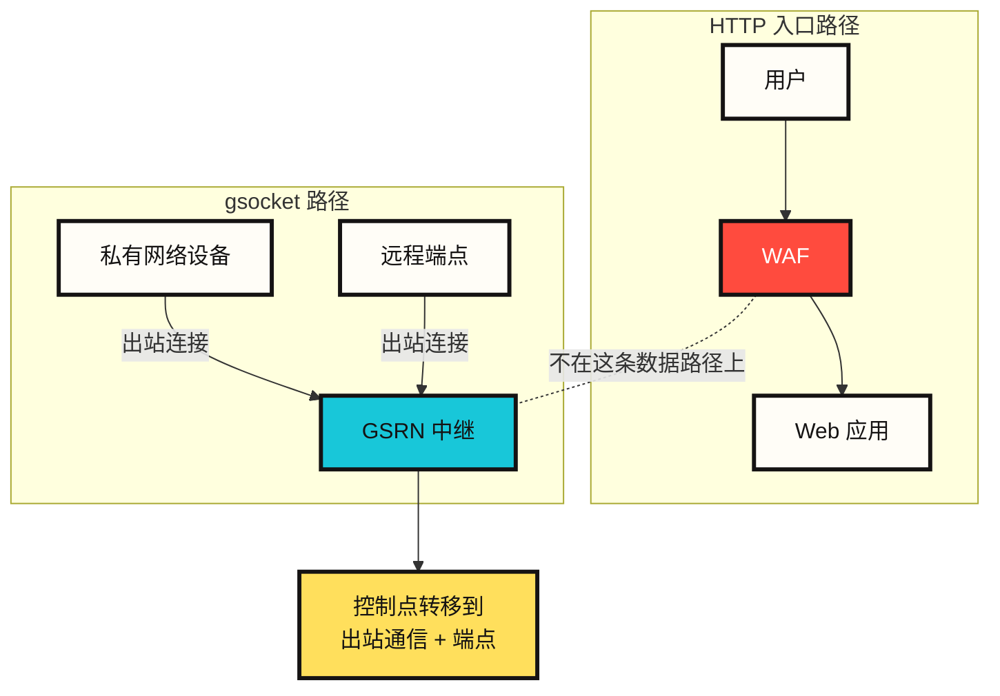
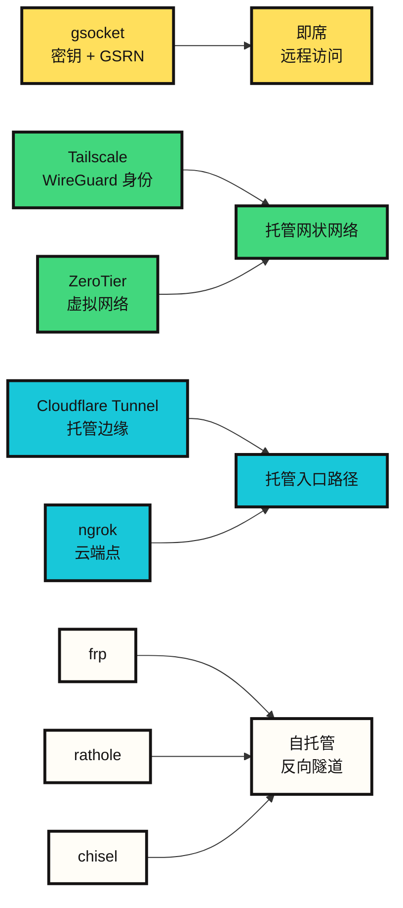

# gsocket 如何连接防火墙后的设备

第一次看到 gsocket 时，它很容易被理解成一种“穿透防火墙”的工具。官方网站也把“像没有防火墙一样连接”放在很显眼的位置。但从安全角度看，更准确的解释并不是这样。

gsocket 不是通过攻击 Web 应用防火墙(WAF)来通过检查。它更像是绕开 WAF 所在的 HTTP 路径，通过出站中继连接建立一条单独的 TCP 路径。因此它看起来像 WAF 绕过，但实际发生的是通信路径本身发生了变化。

理解这个差异很重要。它决定了我们应该把 gsocket 视为一种运维连接工具，还是视为一条有风险的非官方远程访问路径。

## gsocket 简要说明

gsocket，更准确地说是 Global Socket，是一种 TCP 连接工具。它让位于 NAT 或防火墙后的两个程序，即使不知道彼此的直接地址，也能建立通信。

普通连接通常基于地址和端口。

```text
IP 地址 + 端口 + 防火墙规则 -> 连接
```

gsocket 改变了这个模型。

```text
共享密钥 + 出站中继连接 -> 连接
```

两个端点知道同一个共享密钥，并且都向 Global Socket Relay Network(GSRN)建立出站连接。中继网络会匹配这两个端点。之后，两个端点之间形成一条加密的 TCP 流。

用更直白的话说：

```text
两个互相不知道地址的设备
带着同一个口令
来到同一个接头地点
在那里找到彼此并开始通信。
```

这里的口令是连接密钥，接头地点是 GSRN，互相找到的过程就是 rendezvous。



## 术语

| 术语 | 含义 |
|---|---|
| 端点(endpoint) | 连接两端的程序或设备 |
| NAT | 将私有 IP 隐藏在公网 IP 后面的网络地址转换机制 |
| 防火墙 | 按策略允许或阻断入站、出站通信的控制点 |
| WAF | 检查 HTTP 请求的 Web 应用防火墙 |
| 中继(relay) | 在两个端点之间转发通信的服务器或网络 |
| GSRN | Global Socket Relay Network，gsocket 端点连接的中继基础设施 |
| Rendezvous | 不知道彼此直接地址的端点在中间地点找到彼此的过程 |
| 共享密钥 | 两个端点共同知道的连接密钥 |
| 端到端加密 | 在两个端点之间加密，使中继服务器不能以明文读取载荷 |
| 出站通信(egress) | 从内部网络流向互联网的通信 |
| 非官方远程访问 | 位于已批准 VPN、堡垒机或管理系统之外的远程访问路径 |

## 不是 WAF 绕过，而是路径绕过

WAF 通常检查进入 Web 应用的 HTTP 请求。

```text
用户 -> WAF -> Web 应用
```

gsocket 的模型不同。

```text
私有网络设备 -> Global Socket 中继网络 <- 远程端点
```

私有网络设备不会打开入站端口。它会向外部中继网络建立出站连接。远程端点也连接到同一个中继网络。双方通过同一个共享密钥在中继网络中找到彼此，然后建立加密的 TCP 流。

WAF 看不到这段通信，并不是因为 WAF 被攻破了，而是因为这段通信根本没有经过 WAF 所在的 HTTP 入口路径。要控制这个问题，比起 WAF 规则，更重要的是出站通信控制、端点进程控制和远程访问治理。



## Rendezvous：用同一个密钥找到彼此

在网络语境中，rendezvous 指的是两个不知道彼此直接地址、或者无法直接连接的端点，在一个中间地点找到彼此并建立连接的过程。

在 gsocket 中，这个中间地点就是 Global Socket Relay Network，也就是 GSRN。官方 README 将 GSRN 描述为连接 TCP 管道的免费云服务。端点不需要知道对方的 IP 地址或端口。双方只需要知道同一个共享密钥。

```text
位于 NAT 后的端点 A
  -> 向 GSRN 建立出站连接

位于 NAT 后的端点 B
  -> 向 GSRN 建立出站连接

共享密钥
  -> 在本地派生 rendezvous 身份和会话材料

GSRN
  -> 匹配两个端点
  -> 中继加密通信
```

根据官方 README，共享密钥不会离开工作设备。会话密钥和 ID 会在本地派生。GSRN 负责中继通信，但载荷采用端到端加密。

这个结构可以用一句话概括：

```text
gsocket 是一种把共享密钥当作访问能力使用的中继式 TCP 连接模型。
```

## GSRN 是 Tor 吗

GSRN 是中继基础设施，但不应把它理解成 Tor 那样的志愿者中继网络。Tor 是以匿名性为目标的多跳洋葱路由网络，许多中继节点由志愿者运行。根据 gsocket 的官方材料，GSRN 更接近一种免费云服务。

两者的相似点仅限于“使用中间中继”。目标并不相同。

| 项目 | gsocket GSRN | Tor |
|---|---|---|
| 主要目的 | 连接 NAT/防火墙后的端点 | 匿名性和洋葱路由 |
| 连接依据 | 共享密钥 | 洋葱电路 |
| 中继模型 | GSRN 云中继 | 志愿者中继网络 |
| 路径 | 中继式 TCP 流 | 多跳洋葱路径 |
| 安全关注点 | 密钥生命周期、端点进程、出站通信审计 | 匿名集合、出口节点、回路隔离 |

gsocket 支持 Tor 选项，但这并不意味着 gsocket 本身就是类似 Tor 的网络。

## 密钥就是访问能力

在 gsocket 中，共享密钥不只是一个认证字符串。知道密钥的一方就能建立连接。因此，共享密钥实际上就是访问能力本身。

从这个角度看，风险会更清楚。

| 设计元素 | 优点 | 风险 |
|---|---|---|
| 共享密钥 | 不暴露地址和端口也能连接 | 密钥泄漏时端点会暴露 |
| 出站中继 | 不需要入站防火墙规则 | 通过出站通信形成非官方访问 |
| 端到端加密 | 中继服务器难以读取载荷 | 端点失陷和进程审计问题仍然存在 |
| 与既有工具组合 | 可与 SSH、文件传输、代理、VPN 模型结合 | 可被滥用为远程 shell、代理跳板或常驻执行 |

安全使用 gsocket 应该先提出这些问题。

```text
这条连接是谁批准的？
哪台设备被暴露了？
共享密钥的有效期有多长？
实际打开的能力是什么：shell、文件传输，还是 Web 预览？
出站通信和进程生命周期是否被记录？
会话结束后的清理是否得到确认？
```

## 这篇公开文章如何处理命令

官方 gsocket 示例中包含强双重用途能力，包括远程 shell、SSH 暴露、常驻执行和监视进程、代理、文件传输、VPN 隧道等。本文不会复现这些执行命令。

这不是为了回避技术深度。命令行一旦脱离上下文，很容易直接变成后门操作步骤。公开文章应该保留下来的，是分析框架，而不是命令配方。

因此，本文按下面的方式处理这些功能组。

| 功能组 | 合法用途 | 风险 |
|---|---|---|
| 临时服务转发 | 预览私有开发服务 | 未批准的服务暴露 |
| 文件传输 | 在自有端点之间移动产物 | 数据进出路径 |
| 远程支持 | 临时排查 NAT 后设备的问题 | 未审计的远程 shell |
| 代理或隧道 | 实验网络路由测试 | 私有网络跳转路径 |
| 常驻会话 | 应急恢复中的自动重连 | 常驻执行 |

运维文档应先写防护边界，再写命令。

## 与类似工具的差异

很多工具看起来与 gsocket 相似，但它们并不都在解决同一个问题。



| 工具 | 核心模型 | 与 gsocket 的差异 |
|---|---|---|
| Tailscale | 基于 WireGuard 的 tailnet、直接 UDP 连接、DERP 中继备用路径 | 以身份、ACL、设备认证为中心的长期托管网状网络 |
| ZeroTier | P2P VL1 和以太网虚拟化 VL2 | 以虚拟网络和控制器成员关系为中心 |
| Cloudflare Tunnel | `cloudflared` 向 Cloudflare 边缘建立出站隧道 | 与访问策略和身份提供方结合的托管入口路径 |
| ngrok | 本地代理向 ngrok 云端点建立隧道 | 面向开发预览、公开端点、通信检查和策略功能 |
| frp | 自托管反向代理 | 用户直接运行中继服务器 |
| rathole | 基于 Rust 的自托管反向代理 | frp/ngrok 的替代方案，服务器/客户端拓扑明确 |
| chisel | 在 HTTP 传输上建立 TCP/UDP 隧道，并由 SSH 保护 | HTTP 友好的隧道，服务器端点由用户自运维 |
| gsocket | 共享密钥 + GSRN 中继 | 以即席访问能力为中心，治理需要单独设计 |

选择标准很直接。

| 目标 | 适合的工具 |
|---|---|
| 一次性实验网络连接 | gsocket |
| 长期私有网状网络 | Tailscale, ZeroTier |
| 公开 Web 或应用 | Cloudflare Tunnel, ngrok |
| 基于自有 VPS 的反向代理 | frp, rathole |
| 只能通过 HTTP 出站的环境中的 TCP 隧道 | chisel, ngrok, Cloudflare Tunnel |
| 需要 SSO、审计、策略的生产网络 | Tailscale, Cloudflare Tunnel, ZeroTier |

gsocket 的进入门槛很低。这既是优点，也是风险。

## 防御侧检查清单

防御性分析 gsocket 类工具时，不能只看入站防火墙，更要看出站通信和端点。

```text
未经确认的长期出站连接
意外出现的 gsocket 或隧道执行文件
密钥留在 shell 历史或配置文件中
没有堡垒机或 VPN 记录却暴露的服务
daemon、watchdog、cron、launch agent 注册
代理、挂载、文件传输、隧道接口
Tor 或代理中继配置
```

一个实用的响应顺序如下。

1. 确认设备负责人和批准记录。
2. 捕获进程树、执行文件路径、哈希、环境变量和打开的 socket。
3. 撤销或轮换共享密钥及相关账号。
4. 检查 systemd、launchd、cron、shell rc、container entrypoint。
5. 审查私有网络区段的连接流和文件移动痕迹。
6. 会话结束后，通过重启或服务重启确认是否复发。

## 结论

gsocket 不是“突破 WAF 的工具”。更准确地说，它不使用 WAF 所观察的 HTTP 路径，而是通过共享密钥和中继基础设施建立另一条 TCP 连接路径。

它本身是一种有用的连接原语。它可以快速解决 NAT 后实验设备、临时支持、私有工作设备、文件传输等问题。但同样的结构如果与长期密钥、常驻执行、代理跳板结合，就会变成非官方远程访问。

因此，gsocket 的核心问题不是“能不能用”，而是“应该在什么治理框架下使用”。

```text
密钥就是访问能力。
中继会改变路径。
出站通信是新的边界。
端点进程才是真正的控制点。
```

## Sources

- https://github.com/hackerschoice/gsocket
- https://www.gsocket.io/
- https://tailscale.com/docs/reference/connection-types
- https://docs.zerotier.com/protocol/
- https://developers.cloudflare.com/cloudflare-one/networks/connectors/cloudflare-tunnel/
- https://ngrok.com/docs/agent
- https://github.com/fatedier/frp
- https://github.com/jpillora/chisel
- https://github.com/rathole-org/rathole
